# TWOG

**TWOG is a living research engine for canine hemangiosarcoma and related vascular cancers.**

It is built to move from messy biomedical evidence to inspectable candidate records: source documents, citations, agent critiques, method versions, decision logs, compute artifacts, and public contribution intake.

The goal is not to claim that AI can replace scientific review. The goal is to make research work easier to trace, challenge, reproduce, and improve.

Live site: [twog.bio](https://twog.bio)

License: Apache License 2.0. See [LICENSE](LICENSE) and [NOTICE](NOTICE).

## The Short Version

TWOG is an AI-assisted research operating system for comparative oncology.

It focuses first on canine hemangiosarcoma, an aggressive and under-served cancer with translational relevance to human angiosarcoma. The system ingests open biomedical evidence, turns it into typed research records, lets specialist agents synthesize and critique the evidence, and promotes only reviewed outputs into durable candidate records and validation queues.

The core rule is simple:

> LLMs argue and synthesize. Operator approval is the write gate.

TWOG is not a treatment recommendation system, not a clinical decision tool, and not a black-box "AI finds a cure" demo. It is infrastructure for making AI-assisted research legible.

## Why It Matters

Most early AI-for-science demos stop at the exciting output: a hypothesis, a molecule, a model score, a generated summary. TWOG is focused on the harder layer underneath: preserving the chain of reasoning so a person can inspect what happened.

Every serious claim should answer:

- What source evidence supports it?
- What citations and records were used?
- Which agent or model produced the synthesis?
- Which assumptions were challenged?
- What method version or compute configuration produced the result?
- Who approved the next step?
- What would change confidence?

That audit trail is the product.

## What Is Live

- Public website at [twog.bio](https://twog.bio).
- Public candidate pages with machine-readable JSON payloads.
- Candidate checkout/check-in flow for structured outside critique.
- Neon/Postgres-backed contribution intake.
- Dagster-readable intake and triage jobs.
- Local SQLite and hosted Postgres storage adapters.
- Agent run ledger, review ledger, research briefs, therapy ideas, validation packets, omics readouts, and compute ledgers.
- Deterministic ingestion lanes for literature, structured biomedical sources, source health, candidate records, and public contribution intake.
- OpenRouter-backed agent lanes for synthesis, critique, evaluation, and research-program reasoning.
- TWOG-owned RunPod/Docker worker foundation for approval-first MD smoke tests.

## What To Inspect First

If you are reviewing this from the outside, start here:

1. [twog.bio](https://twog.bio)
   The public-facing explanation of the mission, methods, architecture, and candidate records.

2. [Example candidate record](https://twog.bio/candidates/twog-15f50d)
   A public proof artifact with rationale, evidence, risk notes, method refs, decision history, and JSON payload access.

3. [Candidate record method](https://twog.bio/methods/candidate-record-v1)
   How evidence refs, content hashes, checkout payloads, and check-in packets work.

4. [Citation dedupe method](https://twog.bio/methods/citation-dedupe-v1)
   How the system treats duplicate citations and source provenance.

5. [Public contribution workflow](docs/PUBLIC_CONTRIBUTION_WORKFLOW.md)
   How outside work enters intake without directly mutating candidate state.

6. [System guide](docs/TWOG_V2_SYSTEM_GUIDE.md) and [module flowcharts](docs/TWOG_V2_MODULE_FLOWCHARTS.md)
   Longer internal explanations of how the research system fits together.

## System Shape

```text
open biomedical evidence
  -> deterministic ingestion
  -> typed research records
  -> search and evidence memory
  -> agent synthesis and critique
  -> research programs
  -> therapy ideas
  -> validation packets
  -> public candidate records
  -> contribution intake
  -> compute / lab-facing validation queues
```



```mermaid
flowchart LR
    A["Open scientific sources"] --> B["Deterministic ingestion"]
    B --> C["Typed research records"]
    C --> D["Agent synthesis and critique"]
    D --> E["Research programs"]
    E --> F["Therapy ideas"]
    F --> G["Validation packets"]
    G --> H["Public candidate records"]
    H --> I["Checkout payloads"]
    I --> J["Contributor check-in"]
    J --> K["Operator triage"]
    K --> L["Evidence / validation / compute queues"]
```

## Architecture Principles

### Deterministic ingestion first

Source collection, normalization, chunking, and record creation are deterministic where possible. LLMs are used for synthesis and critique, not silent mutation of the evidence layer.

### Typed contracts at every boundary

Research objects, chunks, briefs, agent runs, therapy ideas, validation packets, omics readouts, candidate records, contribution packets, and compute jobs are schema-validated. The system should fail loudly when a record does not match the contract.

### Durable ledgers over loose outputs

TWOG stores the run, the inputs, the model profile, the output payload, the errors, the review, and the operator decision. A good-looking answer without lineage is not enough.

### Operator approval as write gate

Agents can recommend, critique, summarize, and queue work. They do not silently promote public candidate state, run GPU jobs, or mutate research records without an explicit gated path.

### Public proof, not public mutation

Candidate pages expose readable records and machine-readable payloads. Public check-ins enter intake. They do not directly alter candidate state.

### Compute is ledgered and approval-first

GPU-backed work is treated as a scientific artifact lane: container image, inputs, method version, cost/capacity bounds, run status, logs, outputs, and failure diagnostics are persisted.

## Source And Evidence Lanes

Current ingestion and source-monitoring work spans:

- PubMed
- Europe PMC
- PMC Open Access
- OpenAlex
- Crossref
- ClinicalTrials.gov
- PubChem
- ChEMBL
- UniProt
- RCSB PDB
- OpenFDA animal adverse events
- monitored X/Twitter research signals
- processed omics matrix discovery and readouts

The source lanes are intentionally separate. A trial registry record, a PubMed abstract, a compound annotation, an omics matrix, an adverse event report, and a social signal should not carry the same epistemic weight.

## Public Candidate Records

The public site lives in [`twog/`](twog/).

Key routes:

```text
/                                           Mission homepage
/architecture                              Technical architecture overview
/candidates                                Candidate index
/candidates/twog-15f50d                    Example candidate record
/methods                                   Method index
/methods/candidate-record-v1               Candidate record method
/methods/citation-dedupe-v1                Citation dedupe method
/api/public-candidates                     Public candidate payload index
/api/public-candidates/{candidate_id}      One public candidate payload
```

The readable page is for humans. The JSON payload is for researchers, reviewers, and other tools.

## Checkout / Check-In Loop

TWOG's public collaboration loop is deliberately gated:

1. Check out a candidate payload.
2. Inspect evidence, citations, risks, methods, decision history, and content hash.
3. Do outside work: critique, citation repair, replication, artifact generation, validation design, or compute review.
4. Check in a structured contribution packet.
5. TWOG routes the packet through intake, provenance review, citation dedupe, evidence review, validation planning, or compute review.

Outside submissions do not directly mutate a candidate record. That is the point.

## Research Program Layer

TWOG separates big scientific programs from individual therapy ideas.

A research program defines a thesis, disease model, decisive questions, evidence tasks, confidence criteria, stop criteria, and downstream opportunity families. Therapy ideas are children of that program. Validation packets are children of those ideas.

That structure keeps the system from endlessly iterating on small tactical ideas. The board asks: what big bet is worth pursuing, what evidence would change confidence, and when do we stop?

## Agent Layer

Agents are used as specialist reviewers and synthesis workers. They can:

- write citation-first research briefs;
- evaluate brief quality;
- critique candidate evidence;
- review full-text ingestion health;
- reason about therapy programs;
- generate therapy committee outputs;
- plan validation tasks;
- review omics readouts;
- evaluate other agents' performance.

Every meaningful agent run is ledgered. The system stores model metadata, prompt/version metadata, input payloads, output payloads, summaries, errors, and reviews.

## Compute Layer

TWOG has an approval-first compute lane for GPU-backed scientific jobs.

The first owned worker path is an MD smoke worker under [`runpod_workers/md_smoke/`](runpod_workers/md_smoke/). The goal of this lane is not to make efficacy claims from short simulations. The goal is to prove the worker contract, artifact flow, structured diagnostics, and reproducible compute ledger before any heavier scientific workflow is trusted.

Future compute lanes can include docking, longer MD, free-energy estimation, raw omics processing, or other containerized methods, but each needs a method version, artifact policy, and approval gate.

## Repository Layout

```text
.
├── src/hsa_research/ingestion_bridge/   Core research contracts, services, agents, stores
├── src/hsa_dagster/                     Dagster definitions and jobs
├── tests/                               Contract, service, API, and worker tests
├── docs/                                SOPs, architecture, setup, public explanations
├── db/migrations/                       Research-store migrations
├── runpod_workers/md_smoke/             TWOG-owned MD smoke worker
├── twog/                                Public Next.js site and candidate layer
│   ├── app/                             Pages and API routes
│   ├── data/                            Static public candidate snapshots
│   ├── db/migrations/                   Public contribution-intake migration
│   ├── lib/                             Candidate payload and contribution services
│   └── scripts/                         Candidate sync and Neon migration scripts
└── .github/workflows/                   Dagster, validation, and worker automation
```

## Local Research System

Install and validate:

```bash
uv sync
uv run pytest tests/test_ingestion_bridge_contracts.py
uv run dg check defs
```

Run Dagster locally:

```bash
uv run dg dev
```

Local development defaults to SQLite under `var/`. Hosted runs use Postgres/Neon through `HSA_STORAGE_BACKEND=postgres` and `HSA_DATABASE_URL`.

## Public Site

Run the public site:

```bash
cd twog
npm install
npm run build
npm start -- --port 3000
```

Refresh static candidate snapshots:

```bash
cd twog
npm run sync:candidates
```

Apply the public contribution-intake migration:

```bash
cd twog
npm run db:migrate
```

Configure one database URL for contribution intake:

```text
NEON_DATABASE_URL=<postgres connection string>
```

Supported aliases:

- `DATABASE_URL`
- `POSTGRES_URL`
- `HSA_DATABASE_URL`

## Project Maturity

This is active research infrastructure. Some lanes are production-backed, some are local-first, and some are deliberately manual until they prove useful.

Reliable today:

- public site and candidate payload rendering;
- static candidate export;
- public contribution intake contract;
- Dagster definitions and manual jobs;
- typed contracts and repository adapters;
- agent run/review ledgers;
- research briefs, therapy ideas, validation packets, and candidate records.

Still maturing:

- broader candidate export volume;
- method pages for every compute lane;
- external contribution review experience;
- owned GPU compute worker hardening;
- deeper primitive layers for entity resolution, compound similarity, ortholog mapping, and bioactivity indexing.

## Safety Boundary

TWOG candidate records do not certify efficacy, safety, dosing, clinical readiness, veterinary use, or regulatory fitness. They are research artifacts for inspection, challenge, and improvement.

Any medical or veterinary decision belongs with qualified professionals.

## License

Code in this repository is licensed under the [Apache License 2.0](LICENSE). The repository includes a [NOTICE](NOTICE) file for attribution.

Public candidate records, method pages, and data artifacts may carry separate content or data terms when published. Unless a public artifact explicitly says otherwise, treat it as a research record for inspection, critique, and contribution through the documented intake flow.

## The Bet

TWOG is built for Graffiti, Brady, and every dog whose disease deserves more scientific attention than the market has given it.

It is also a bet that modern AI can be used responsibly: not to replace science, but to help more people read broadly, ask better questions, preserve the reasoning trail, and move promising ideas toward real validation.
