# TWOG

**TWOG is a living research engine for canine hemangiosarcoma and related vascular cancers.**

This repository contains the active v2 system: Dagster-backed research orchestration, structured biomedical ingestion, agent synthesis and validation lanes, RunPod/Docker compute work, and the first public-proof website layer.

The practical aim is to make serious scientific work easier to inspect. TWOG does not just publish conclusions. It preserves the chain of reasoning: source evidence, agent critiques, method versions, candidate records, decision logs, compute artifacts, and public contribution intake.

Live site: [twog.bio](https://twog.bio)

## For Reviewers

If you are evaluating TWOG from the outside, start here:

- [Public site](https://twog.bio): mission, methods, and candidate records.
- [Candidate index](https://twog.bio/candidates): inspectable public records generated from the internal pipeline.
- [Example candidate](https://twog.bio/candidates/twog-15f50d): a candidate page with rationale, evidence, risks, method references, decision history, and a machine-readable payload.
- [Candidate record method](https://twog.bio/methods/candidate-record-v1): how public records, evidence refs, content hashes, and check-in submissions work.
- [Public contribution workflow](docs/PUBLIC_CONTRIBUTION_WORKFLOW.md): how checkout payloads, check-in packets, Neon intake, and operator triage fit together.

The important design choice is that TWOG does not treat a web page as marketing copy. A candidate page is intended to be a public research artifact: readable by a person, exportable as JSON, traceable back to pipeline records, and open to structured critique.

## Why This Exists

Canine hemangiosarcoma is aggressive, common in dogs, and underserved by conventional drug discovery economics. It also overlaps with human vascular cancers such as angiosarcoma, making it a meaningful comparative oncology problem.

TWOG is built around that gap: use modern AI and automation to read broadly, organize evidence carefully, surface big therapeutic ideas, critique them with specialist agents, and move only the strongest signals toward validation.

This is research infrastructure. It is not a treatment recommendation system.

## System Shape

```text
public evidence
  -> structured ingestion
  -> normalized research records
  -> agent synthesis and critique
  -> research programs
  -> therapy ideas
  -> public candidate records
  -> contribution intake
  -> validation and compute queues
```

## Current System

- Typed research contracts for literature, source records, agent runs, briefs, therapy ideas, validation packets, omics readouts, and compute jobs.
- Local SQLite development storage and hosted Postgres/Neon runtime support.
- Dagster asset graph for observable ingestion, synthesis, validation, source health, embeddings, and compute lanes.
- Structured source harvesters for PubChem, ChEMBL, UniProt, RCSB PDB, OpenFDA animal adverse events, PubMed, Europe PMC, PMC OA, OpenAlex, Crossref, ClinicalTrials.gov, and monitored X/Twitter topics.
- Public candidate record layer under `twog/`.
- Public JSON payloads for candidate checkout.
- Neon-backed contribution intake API for candidate check-ins.
- Dagster-readable candidate contribution intake and triage jobs for operator review.
- Command Center contribution triage panel for previewing and applying explicit intake decisions.
- MCP-ready service boundary for future agent/human tool sharing.
- RunPod/Docker worker foundation for expert-gated MD smoke tests.

## Architecture At A Glance

```mermaid
flowchart LR
    A["Public scientific sources"] --> B["Structured ingestion"]
    B --> C["Research object store"]
    C --> D["Agent synthesis and critique"]
    D --> E["Research programs"]
    E --> F["Therapy ideas"]
    F --> G["Candidate records"]
    G --> H["Public payloads"]
    H --> I["Contributor check-in"]
    I --> J["Neon intake table"]
    J --> K["Dagster intake report"]
    K --> L["Evidence review / validation queues"]
    L --> M["Compute and artifact records"]
```



There are three deliberate boundaries:

- **Evidence boundary:** ingestion and chunking are deterministic where possible, with LLMs used for synthesis and critique rather than silent data mutation.
- **Public boundary:** candidate pages expose payloads and accept check-ins, but public submissions do not directly alter candidate state.
- **Compute boundary:** GPU jobs are approval-first and ledgered; smoke workers prove artifact flow before any heavier scientific claim is made.

## Public Proof Layer

The public website lives in `twog/`.

Key routes:

```text
/                                           Mission homepage
/candidates                                 Candidate index
/candidates/twog-15f50d                     Example public candidate record
/methods/candidate-record-v1                Candidate record method
/api/public-candidates                      Public candidate payload index
/api/public-candidates/{candidate_id}        One public candidate payload
/api/public-candidates/{candidate_id}/contribution-template
/api/public-candidates/{candidate_id}/contributions
```

The page is the readable record. The payload is the machine-readable record. The contribution endpoint is the public check-in path.

## Check Out / Check In

TWOG's public collaboration loop is designed as a gated evidence exchange:

1. **Check out** a candidate payload.
2. Inspect the evidence, rationale, risks, citations, method refs, and content hash.
3. Do outside work: replication, critique, citation repair, artifact generation, validation design, or compute review.
4. **Check in** a structured contribution packet.
5. TWOG queues the packet for intake, provenance review, citation dedupe, and routing into evidence review, validation planning, or compute review.

Outside submissions do not directly mutate a candidate record. That gate is intentional.

## What Is Live Now

- Mission-first public website on `twog.bio`.
- Static public candidate records with JSON payloads.
- Neon/Postgres-backed contribution intake endpoint.
- Production storage readiness check on candidate contribution routes.
- Manual Dagster report job for contribution intake visibility.
- Production-tested operator triage job for starting review, requesting more information, accepting into evidence/validation/compute review, rejecting, or archiving.
- Command Center surface for contribution review and explicit triage actions.
- Internal records for research programs, therapy ideas, briefs, validation packets, omics readouts, agent runs, reviews, and compute jobs.

## What Comes Next

- More candidate records exported from the internal system.
- Stronger public method pages for docking, MD smoke tests, omics readouts, and synthesis review.
- Dedicated GPU compute path using TWOG-owned containers and persisted artifacts.
- A cleaner public audit trail connecting candidate pages back to agent runs, evidence packets, and compute outputs.
- Recommend-only LLM reviewer for contribution triage, with operator approval kept as the write gate.

## Repository Layout

```text
.
├── src/hsa_research/ingestion_bridge/   Core research contracts, services, agents, stores
├── src/hsa_dagster/                     Dagster definitions
├── tests/                               Contract and worker tests
├── docs/                                SOPs, architecture, setup, public explanations
├── db/migrations/                       Backend research-store migrations
├── runpod_workers/md_smoke/             TWOG-owned MD smoke worker
├── twog/                                Public Next.js site and public candidate layer
│   ├── app/                             Pages and API routes
│   ├── data/                            Static public candidate snapshots
│   ├── db/migrations/                   Public contribution-intake migration
│   ├── lib/                             Candidate payload and contribution services
│   └── scripts/                         Candidate sync and Neon migration scripts
└── .github/workflows/                   Dagster, validation, and worker automation
```

## Dagster

Install and validate:

```bash
uv sync
uv run pytest tests/test_ingestion_bridge_contracts.py
uv run dg check defs
```

Run locally:

```bash
uv run dg dev
```

Production deploys are handled by Dagster+ GitHub Actions on pushes to `main`.

## Public Site

Run the public site:

```bash
cd twog
npm install
npm run build
npm start -- --port 3000
```

Refresh candidate snapshots from the local Command Center:

```bash
cd twog
npm run sync:candidates
```

## Neon Contribution Intake

The public checkout routes are read-only. The check-in route writes to Neon/Postgres:

```text
POST /api/public-candidates/{candidate_id}/contributions
```

Set one database URL:

```bash
NEON_DATABASE_URL=postgresql://...
```

Supported aliases:

- `DATABASE_URL`
- `POSTGRES_URL`
- `HSA_DATABASE_URL`

Apply the public-site migration:

```bash
cd twog
npm run db:migrate
```

The migration creates `candidate_contribution_intake`, with indexes by candidate, status, requested action, and created time.

Operator review is handled from the Command Center and Dagster:

```text
candidate_contribution_intake_report_job
candidate_contribution_triage_job
```

The triage job previews by default and only writes when `dry_run=false`. The first production write path was validated against a controlled test contribution on 2026-05-19 Mountain time / 2026-05-20 UTC.

## Safety Boundary

TWOG candidate records do not certify efficacy, safety, dosing, clinical readiness, veterinary use, or regulatory fitness. They are research artifacts for inspection, challenge, and improvement.

Any medical or veterinary decision belongs with qualified professionals.

## Why It Matters

TWOG is built for Graffiti, Brady, and every dog whose disease deserves more scientific attention than the market has given it.

It is also a bet that AI can be used for something practical and humane: helping more people ask better questions, learn faster, and contribute to research that would otherwise stay out of reach.
