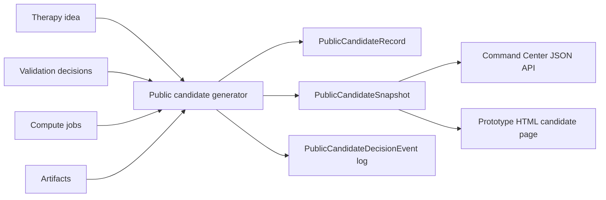

# TWOG Public Candidate Records

## Purpose

Public candidate records are the first public-proof layer for TWOG. They turn an internal therapy idea into an inspectable snapshot that can be cited, reviewed, and later rendered as a public page.

The record is not a marketing page. It is an audit artifact:

- what the candidate is,
- why TWOG considered it,
- which evidence supports it,
- which validation decisions are attached,
- which compute jobs or artifacts are attached,
- which version of the pipeline generated the snapshot,
- and which decision-log events explain status changes.

This keeps the science and the public narrative connected to the same durable records.

## Record Types

The layer has three records:

- `PublicCandidateRecord`: current identity and lifecycle state.
- `PublicCandidateSnapshot`: immutable page payload for one generated version.
- `PublicCandidateDecisionEvent`: append-only decision log for status changes, evidence attachment, compute attachment, and snapshot generation.

The current source is a persisted `TherapyIdeaRecord`. The snapshot generator also pulls linked validation decisions, matching compute jobs, and compute artifacts when available.

## Moonshot Gate

Public candidate generation now defaults to a moonshot-grade gate. The public layer should surface only high-conviction, program-level bets: ideas with a strong score, a high-level thesis signal, evidence anchors, defined mechanism/therapy shape, and a validation path. Incremental follow-ups, dose-monitoring notes, safety-only checks, and "kinda sorta maybe" ideas should stay in internal research queues.

The default gate requires:

- `priority_score >= 0.80`
- a research-program lineage or explicit high-level thesis terms such as `strategy`, `platform`, `ecology`, `peptide`, `cross-species`, `biomarker-stratified`, or `disease-modifying`
- at least two evidence anchors, or medium/high evidence strength
- candidate therapy plus target/biomarker/mechanistic shape
- at least one next experiment and one risk note

Failed ideas return `public_candidate_requires_moonshot_grade` and a structured `moonshot_gate` payload. Operators can bypass the gate only for admin previews with `--allow-non-moonshot`; that override should not be used for normal public surfacing.

## Current Flow



## CLI

List candidates:

```bash
PYTHONPATH=src .venv/bin/python -m hsa_research.ingestion_bridge.cli public-candidates
```

Generate a snapshot from a therapy idea:

```bash
PYTHONPATH=src .venv/bin/python -m hsa_research.ingestion_bridge.cli public-candidate-generate \
  --therapy-idea-id <therapy-idea-uuid> \
  --visibility draft_public \
  --pipeline-version v2-local
```

Use a stricter score if needed:

```bash
PYTHONPATH=src .venv/bin/python -m hsa_research.ingestion_bridge.cli public-candidate-generate \
  --therapy-idea-id <therapy-idea-uuid> \
  --visibility draft_public \
  --min-moonshot-score 0.9
```

Preview without writing:

```bash
PYTHONPATH=src .venv/bin/python -m hsa_research.ingestion_bridge.cli public-candidate-generate \
  --therapy-idea-id <therapy-idea-uuid> \
  --no-persist
```

## Command Center APIs

List:

```text
GET /api/public-candidates
```

Filters:

```text
GET /api/public-candidates?status=compute_supported&visibility=draft_public&query=vimentin
```

One candidate:

```text
GET /api/public-candidates/{candidate_id}
```

Prototype HTML page:

```text
GET /public/candidates/{candidate_id}
```

## Status Model

Current public statuses:

- `draft`
- `proposed`
- `investigating`
- `evidence_supported`
- `compute_supported`
- `needs_review`
- `deprecated`
- `archived`

The generator infers status conservatively:

- completed compute job attached -> `compute_supported`
- validation-ready decision attached -> `evidence_supported`
- validation decision or promoted therapy idea attached -> `investigating`
- otherwise -> `proposed`

Operators can override `public_status` at generation time.

## Design Notes

This is intentionally local-first and metadata-first. The large object-storage/IPFS layer can come later. The current system records artifact handles and URIs without forcing an object-storage decision yet.

The first implementation favors therapy ideas because they are already the durable output of the Research Program Board and Therapy Committee layers. Later candidate records can also be generated directly from molecule records, peptide designs, docking campaigns, or validation packets.
