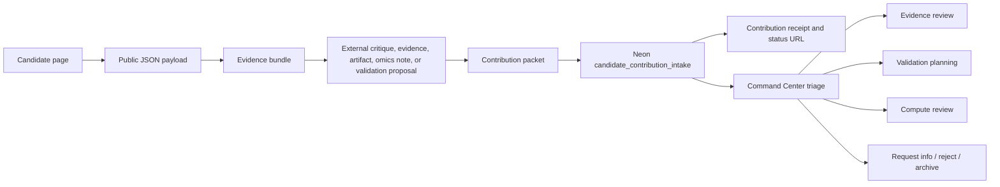

# TWOG Public Contribution Workflow

This document explains the public check-out / check-in loop for candidate records and the Proof Network MVP intake boundary.

## Purpose

TWOG candidate pages are public research records. A reader should be able to inspect the record, pull the machine-readable payload and evidence bundle, do outside work, and submit a structured contribution back to the system.

The contribution path is intentionally gated. Public submissions do not edit candidate records, dispatch validation, or launch compute. They enter intake first.

## Flow



## Public Checkout

Readers can inspect:

```text
/api/public-candidates
/api/public-candidates/{candidate_id}
/api/public-candidates/{candidate_id}/evidence-bundle
/api/public-candidates/{candidate_id}/contribution-template
```

The candidate payload contains the public record state: rationale, evidence refs, literature, risks, decision log, reproducibility metadata, and content hash.

The evidence bundle is the public-safe checkout packet. It includes citation labels, evidence summaries, method references, artifact handles, run-manifest receipt fields, open questions, limitations, and the snapshot hash needed to submit a structured check-in. It is not a raw dump of private notes or unrestricted source chunks.

## Public Check-In

Readers submit a contribution packet to:

```text
POST /api/public-candidates/{candidate_id}/contributions
```

Valid contribution types:

- `evidence_addition`
- `citation_repair`
- `claim_critique`
- `replication_result`
- `compute_artifact`
- `omics_note`
- `validation_proposal`
- `safety_or_translation_note`
- `candidate_demotion_case`

Legacy aliases such as `evidence`, `critique`, `replication`, `artifact`, and `compute_result` may still be accepted for older packets, but new submissions should use the Proof Network names above.

Valid requested system actions:

- `evidence_review`
- `citation_repair`
- `validation_packet`
- `omics_readout`
- `docking_or_md_review`
- `no_action`

A successful submission returns a receipt:

- `contribution_id`
- `received_at`
- `candidate_id`
- `snapshot_content_hash`
- `contribution_content_hash`
- `contribution_type`
- `status`
- `status_url`

Readers can check compact public status at:

```text
GET /api/contributions/{contribution_id}/status
```

The status endpoint exposes receipt and routing state only. It does not expose private review notes.

## Intake Storage

The public site writes to Neon/Postgres table:

```text
candidate_contribution_intake
```

Important fields:

- `contribution_id`
- `candidate_id`
- `display_id`
- `snapshot_content_hash`
- `contribution_content_hash`
- `source_payload_url`
- `status`
- `contribution_type`
- `requested_system_action`
- `contributor`
- `evidence`
- `artifacts`
- `packet`
- `review_notes`
- `promoted_queue_id`

## Operator Triage

The Command Center exposes a public contribution panel that reads intake rows and lets an operator preview or apply triage actions.

Triage actions:

- `start_triage`
- `request_more_information`
- `reject`
- `accept_for_evidence_review`
- `accept_for_validation_queue`
- `accept_for_compute_review`
- `archive`

The Dagster job is:

```text
candidate_contribution_triage_job
```

The job defaults to preview mode. It only mutates Neon when `dry_run=false`.

## Safety Boundary

The public contribution path is a research intake mechanism. It is not medical advice, veterinary advice, or a public route to trigger compute automatically. Public submissions do not change candidate records directly.

Every meaningful state transition should leave a review note, operator identity, timestamp, and, where applicable, a promoted queue marker.
