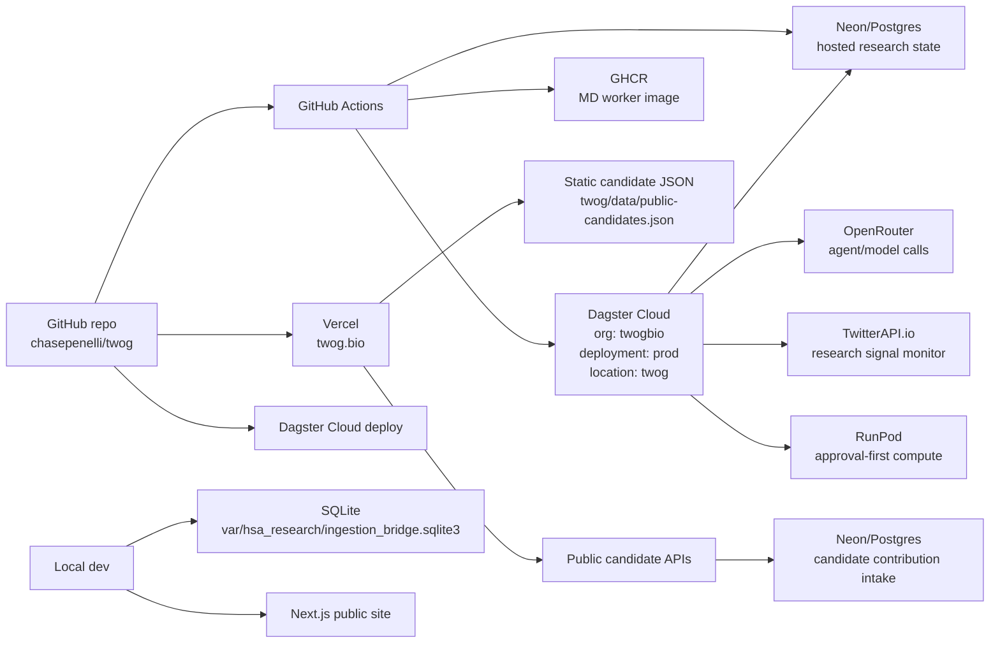
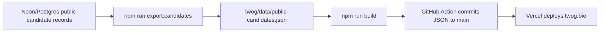
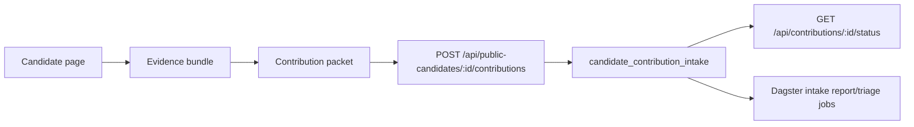
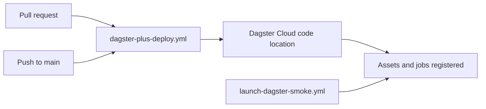
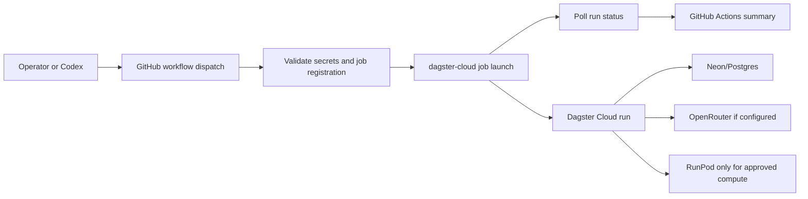
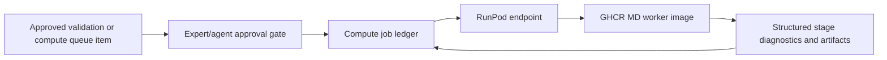

# TWOG System Wiring

This document maps the operational wiring for TWOG: databases, environment variables, GitHub Actions, Dagster Cloud, the public site, agent/model services, and compute. It is written for reviewers and operators who need to understand what runs where without reading the entire codebase.

No secret values belong in this file. It names required variables and systems only.

## High-Level Map



## Source Repositories And App Roots

| Area | Path | Purpose |
| --- | --- | --- |
| Research system | `src/hsa_research/ingestion_bridge/` | Python contracts, repository adapters, services, agents, CLI, MCP, command center, validation, public candidate generation. |
| Dagster definitions | `src/hsa_research/ingestion_bridge/dagster_assets.py` | Assets and jobs used by Dagster Cloud and local `dg` checks. |
| Public website | `twog/` | Next.js app for `twog.bio`, public candidate pages, methods, architecture, public APIs, and contribution intake routes. |
| Root migrations | `db/migrations/` | Hosted research-store migrations for ingestion bridge, research primitives, and public candidates. |
| Public site DB migrations | `twog/db/migrations/` | Neon/Postgres migrations for public contribution intake. |
| Compute worker | `runpod_workers/md_smoke/` | TWOG-owned MD smoke worker image, handler, Dockerfile, and test inputs. |
| Workflows | `.github/workflows/` | GitHub Actions for Dagster deploy, manual Dagster runs, public candidate sync, env sync, worker build, and validation dispatch. |

## Databases

### Local SQLite

Local development defaults to SQLite:

```text
HSA_STORAGE_BACKEND=sqlite
HSA_LOCAL_DB_PATH=var/hsa_research/ingestion_bridge.sqlite3
```

If `HSA_LOCAL_DB_PATH` is not set, the local store uses `var/hsa_research/ingestion_bridge.sqlite3`.

Use SQLite for:

- local command center testing;
- deterministic tests;
- local CLI/Dagster development;
- experiments that do not need hosted state.

### Hosted Neon/Postgres

Hosted research runs use Postgres:

```text
HSA_STORAGE_BACKEND=postgres
HSA_DATABASE_URL=<Neon/Postgres connection string>
```

This store backs the durable hosted research system:

- source registry and raw records;
- research objects and chunks;
- embeddings and source health;
- agent run ledger and reviews;
- research programs;
- therapy ideas;
- validation plans and queues;
- public candidate records and snapshots;
- compute ledgers;
- contribution intake reporting and triage.

The root Python repository expects `HSA_DATABASE_URL` when `HSA_STORAGE_BACKEND=postgres`.

### Public Contribution Intake DB

The Next.js public app writes contribution intake through one of these aliases:

```text
NEON_DATABASE_URL
DATABASE_URL
POSTGRES_URL
HSA_DATABASE_URL
```

The table is:

```text
candidate_contribution_intake
```

Public intake migrations live in:

```text
twog/db/migrations/
```

Current public intake migrations:

- `001_candidate_contribution_intake.sql`
- `002_candidate_contribution_proof_network.sql`

Apply from the public app root:

```bash
cd twog
npm run db:migrate
```

The public route has defensive schema initialization, but production should use explicit migrations so database shape is intentional and reviewable.

## Runtime Environment Variables

### Research / Dagster Runtime

| Variable | Used by | Purpose |
| --- | --- | --- |
| `HSA_STORAGE_BACKEND` | Python research service, Dagster | Selects `sqlite` or `postgres`. Hosted runs use `postgres`. |
| `HSA_DATABASE_URL` | Python research service, Dagster, GitHub Actions | Neon/Postgres connection string for hosted research state. |
| `HSA_CONTACT_EMAIL` | Public and hosted config | Contact target, currently `poppa@bradyandgraffiti.com`. |
| `OPENROUTER_API_KEY` | Agent lanes | Live LLM agent, evaluator, synthesis, committee, and review calls. |
| `HSA_RESEARCH_BRIEF_MODEL` | Research brief jobs | Default research brief model. Hosted workflow currently sets Sonnet 4.6. |
| `HSA_THERAPY_COMMITTEE_MODEL` | Therapy committee jobs | Default committee model. Hosted workflow currently sets Sonnet 4.6. |
| `HSA_BIG_IDEA_OPENROUTER_MODEL` | Big idea/program board | Opus-class model for research program board and big thesis review. |
| `HSA_RESEARCH_PROGRAM_BOARD_MODEL` | Research Program Board | Opus-class model for program-level reasoning. |
| `HSA_EMBEDDING_MODEL` | Embedding lanes | Hosted default is OpenRouter `openai/text-embedding-3-large`. |
| `TWITTERAPI_IO_KEY` | X/Twitter research signal lanes | Enables monitored research social signal jobs. |
| `RUNPOD_API_KEY` | Compute jobs | Required for live RunPod compute submissions. |
| `HSA_RUNPOD_ENDPOINT_ID` | Compute jobs | RunPod endpoint for approval-first compute lane. |

### Public Next.js Runtime

| Variable | Used by | Purpose |
| --- | --- | --- |
| `NEON_DATABASE_URL` / `DATABASE_URL` / `POSTGRES_URL` / `HSA_DATABASE_URL` | `twog/` public APIs | Contribution intake and candidate export scripts. |
| `NEXT_PUBLIC_SITE_URL` | OpenRouter route metadata | Public app URL in OpenRouter referer metadata. |
| `OPENROUTER_API_KEY` | Optional design-lab APIs | Public-site experimental RAG/chat APIs when enabled. |
| `OPENROUTER_MODEL` | Optional design-lab APIs | Chat model override. |
| `OPENROUTER_EMBEDDING_MODEL` | Optional design-lab APIs | Embedding model override. |
| `NEXT_PUBLIC_SUPABASE_URL`, `NEXT_PUBLIC_SUPABASE_ANON_KEY` | Browser-side Supabase utilities | Optional browser Supabase reads. |
| `SUPABASE_URL`, `SUPABASE_SERVICE_ROLE_KEY`, `SUPABASE_ANON_KEY` | Server-side Supabase utilities | Optional server-side design-lab APIs. |

## GitHub Secrets

These secrets are expected by the workflows:

| Secret | Consumed by | Purpose |
| --- | --- | --- |
| `DAGSTER_CLOUD_API_TOKEN` | `dagster-plus-deploy.yml` | Dagster Cloud deploy token for code deployments. |
| `DAGSTER_PLUS_ENV_API_TOKEN` | `configure-dagster-env.yml`, `launch-dagster-smoke.yml`, `terminate-dagster-runs.yml`, reward sync | Dagster Cloud API token for env setup, job launch, polling, and termination. |
| `HSA_DATABASE_URL` | Most hosted workflows | Neon/Postgres database connection string. |
| `OPENROUTER_API_KEY` | Hosted agent workflows | Live model calls. |
| `TWITTERAPI_IO_KEY` | X/Twitter source workflows | Research signal monitoring. |
| `RUNPOD_API_KEY` | Compute workflows | Live RunPod compute submission. |
| `HSA_RUNPOD_ENDPOINT_ID` | Compute workflows | RunPod endpoint selection. |
| `GITHUB_TOKEN` | GitHub Actions automatic token | PR comments, pushes, GHCR publish, workflow-local GitHub operations. |

## GitHub Actions Workflows

### `dagster-plus-deploy.yml`

Name: `Dagster Cloud Serverless Deployment`

Triggers:

- push to `main` or `master`;
- PR open/synchronize/reopen/closed.

Purpose:

- deploys the Python/Dagster code location to Dagster Cloud;
- uses Dagster Cloud serverless deployment;
- updates PR deployment comments;
- uses `DAGSTER_CLOUD_API_TOKEN`.

This is the main CI/deploy path for hosted Dagster definitions.

### `configure-dagster-env.yml`

Name: `Configure Dagster Plus Environment`

Trigger:

- manual `workflow_dispatch`.

Purpose:

- writes full and branch-scope environment variables into Dagster Cloud;
- syncs `HSA_DATABASE_URL`, OpenRouter, TwitterAPI, RunPod, endpoint, and model settings from GitHub Actions secrets.

Use after adding or changing GitHub secrets that Dagster Cloud also needs.

### `launch-dagster-smoke.yml`

Name: `Launch Dagster Smoke Job`

Trigger:

- manual `workflow_dispatch`.

Purpose:

- launches selected hosted Dagster jobs against `twogbio/prod/twog`;
- validates required secrets;
- checks that the requested job is registered;
- launches with optional run config JSON;
- polls until terminal state;
- requests safe termination on timeout.

Important defaults:

```text
DAGSTER_CLOUD_ORGANIZATION=twogbio
DAGSTER_CLOUD_URL=https://twogbio.dagster.cloud
DAGSTER_CLOUD_DEPLOYMENT=prod
DAGSTER_CLOUD_LOCATION=twog
HSA_STORAGE_BACKEND=postgres
DAGSTER_CLOUD_TERMINATE_POLICY_ON_TIMEOUT=SAFE_TERMINATE
```

This is the main manual operations entry point for hosted jobs such as:

- source ingestion/report jobs;
- research brief jobs;
- research program jobs;
- therapy committee jobs;
- omics jobs;
- validation plan/queue jobs;
- compute jobs;
- candidate contribution intake and triage jobs;
- public candidate snapshot and integrity jobs.

### `terminate-dagster-runs.yml`

Name: `Terminate Dagster Runs`

Trigger:

- manual `workflow_dispatch`.

Purpose:

- safely terminates one or more Dagster Cloud runs;
- uses `SAFE_TERMINATE` by default.

Use this for stuck or no-longer-needed hosted runs.

### `validate-hosted-postgres.yml`

Name: `Validate Hosted Postgres`

Trigger:

- manual `workflow_dispatch`.

Purpose:

- runs a small structured-source pipeline against hosted Postgres;
- validates that `HSA_DATABASE_URL` and the repository adapter work in GitHub Actions.

This is a database connectivity and ingestion smoke.

### `sync-public-candidates.yml`

Name: `Sync Public Candidates`

Trigger:

- manual `workflow_dispatch`.

Purpose:

- exports public candidate snapshots from Neon/Postgres into `twog/data/public-candidates.json`;
- checks run manifest metadata when configured;
- builds the public site;
- commits candidate JSON changes back to `main`.

This is the bridge from hosted candidate records to static public website data.

### `build-md-worker.yml`

Name: `Build TWOG MD Worker`

Triggers:

- manual `workflow_dispatch`;
- push to `main` or `codex/**` touching worker files;
- PR touching worker files.

Purpose:

- builds `runpod_workers/md_smoke/` as a Linux AMD64 Docker image;
- runs positive-control and pazopanib/KDR ligand-prep tests;
- verifies docking binaries;
- publishes GHCR image when not running on a PR.

Current image name:

```text
ghcr.io/chasepenelli/twog-md-worker
```

Published tags:

- commit SHA;
- `smoke-v1`.

### `dispatch-validation-queue-items.yml`

Name: `Dispatch Validation Queue Items`

Trigger:

- manual `workflow_dispatch`.

Purpose:

- approves selected validation queue item IDs;
- dispatches them through the validation agent path;
- requires `HSA_DATABASE_URL` and `OPENROUTER_API_KEY`.

This workflow is manual because validation dispatch is an operator action.

### `run-reward-event-sync-once.yml`

Name: `Run Reward Event Sync Once`

Triggers:

- manual `workflow_dispatch`;
- push to `main` touching the workflow.

Purpose:

- launches `reward_event_sync_job` in hosted Dagster;
- waits for completion;
- prints hosted reward ledger summary.

This supports agent-performance/reward event accounting.

## Public Site Wiring

The public site is a Next.js app in `twog/`.

Core scripts:

```bash
cd twog
npm run dev
npm run build
npm start
npm run export:candidates
npm run check:candidate-manifests
npm run db:migrate
```

Public candidate pages render from:

```text
twog/data/public-candidates.json
```

The hosted sync path is:



Public contribution check-in writes directly from Next.js API routes to Neon/Postgres:



Public submissions are intake-only. They do not mutate candidates, dispatch validation, or trigger compute.

## Dagster Cloud Wiring

Dagster Cloud is the hosted orchestration layer.

```text
organization: twogbio
deployment: prod
code location: twog
url: https://twogbio.dagster.cloud
```

The deploy path is:



The job launch path is:



## Agent And Model Wiring

The model policy is split by task class:

- routine research briefs, evaluations, therapy committee, validation reviews, follow-up refinement, evidence-gap agents, and performance evaluators use Sonnet-class defaults;
- big idea / research program board work uses Opus-class defaults;
- embeddings use OpenRouter `openai/text-embedding-3-large` when configured.

Every meaningful agent run should write:

- `agent_runs` row;
- model/profile metadata;
- input payload;
- output payload;
- status/errors;
- summary;
- optional `agent_run_reviews`;
- optional reward/performance events.

The important distinction: these are agent-role ledger entries, not necessarily independent autonomous workers.

## Compute Wiring

The first owned compute lane is MD smoke testing.



Rules:

- live compute requires `RUNPOD_API_KEY`;
- live compute requires `HSA_RUNPOD_ENDPOINT_ID`;
- live compute should require exact packet approval metadata;
- public contributions cannot trigger compute;
- failed worker outputs should be captured as structured diagnostics, not lost as opaque errors.

Worker source:

```text
runpod_workers/md_smoke/
```

Worker image:

```text
ghcr.io/chasepenelli/twog-md-worker:smoke-v1
```

## Database Migration Wiring

Root research-store migrations:

```text
db/migrations/
```

Public contribution-intake migrations:

```text
twog/db/migrations/
```

Operational rule:

- use explicit migrations for hosted environments;
- do not rely on lazy schema creation as the production migration plan;
- confirm the target Neon branch/environment before running migrations.

## Standard Operator Commands

Local research validation:

```bash
uv sync
DAGSTER_HOME=/tmp/dagster-home DAGSTER_DISABLE_TELEMETRY=1 PYTHONPATH=src uv run dg check defs
uv run pytest tests/test_ingestion_bridge_contracts.py
```

Public site validation:

```bash
cd twog
npm ci
npm run build
npm run lint
```

Public intake migration:

```bash
cd twog
npm run db:migrate
```

Hosted Dagster manual job dispatch:

```bash
gh workflow run launch-dagster-smoke.yml \
  --repo chasepenelli/twog \
  --ref main \
  -f job=<dagster_job_name> \
  -f timeout_seconds=900 \
  -f deployment=prod \
  -f location=twog \
  -f config_json='<json>'
```

## Boundaries

The wiring exists to preserve these boundaries:

1. **Evidence boundary**: ingestion and source records are deterministic where possible; LLMs synthesize and critique, but do not silently mutate evidence.
2. **Public boundary**: public candidate pages expose proof records and accept structured check-ins; public submissions enter intake only.
3. **Compute boundary**: GPU/RunPod work is approval-first, ledgered, and artifact-producing.
4. **Deployment boundary**: GitHub Actions carries deploy and manual operation controls; Dagster Cloud executes hosted research jobs; Vercel serves the public site.
5. **Database boundary**: SQLite is local/dev; Neon/Postgres is hosted/runtime; static JSON is the current public candidate delivery layer.

## Current Review Checklist

Before sharing or operating this stack, confirm:

- GitHub Actions secrets exist for `HSA_DATABASE_URL`, `DAGSTER_CLOUD_API_TOKEN`, and `DAGSTER_PLUS_ENV_API_TOKEN`.
- OpenRouter-dependent jobs have `OPENROUTER_API_KEY` configured.
- RunPod-dependent jobs have `RUNPOD_API_KEY` and `HSA_RUNPOD_ENDPOINT_ID` configured.
- Dagster Cloud env has been synced with `configure-dagster-env.yml` after secret changes.
- Public contribution migrations have been applied to the intended Neon branch.
- `sync-public-candidates.yml` has been run after new public candidate records are generated.
- Public site builds cleanly before Vercel production deploy.
- Hosted manual Dagster jobs are launched through `launch-dagster-smoke.yml` with explicit timeout.
