# TWOG V2 Module Flowcharts

This companion document maps the Ingestion Bridge v2 code by lane. It is based
on the current source modules under `src/hsa_research/ingestion_bridge` and the
Dagster entrypoint under `src/hsa_dagster`.

## 1. Cross-Lane Spine

The shared contract is:

```text
source query -> harvester/scraper -> raw source record -> research object
-> document chunks -> resolved entities -> claims -> curated claims
-> embeddings/retrieval -> agents -> validation plans/queues -> command center
```

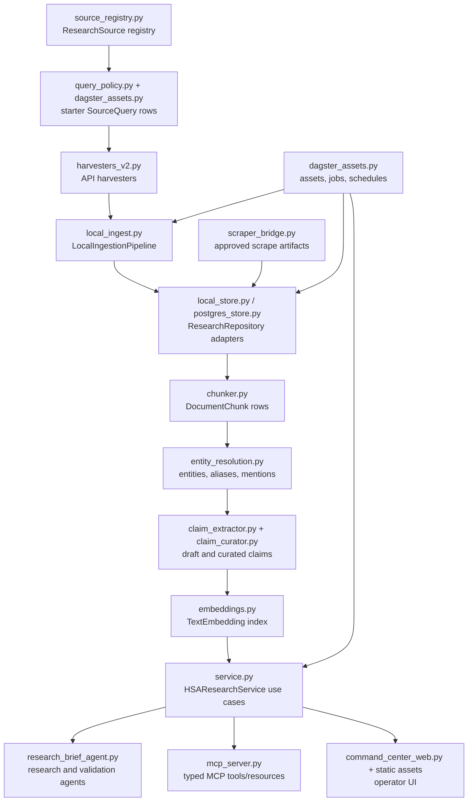

## 2. Ingestion Harvesters

Main modules:

| Module | Role |
| --- | --- |
| `source_registry.py` | Defines registered sources, source class, license policy, phase, capabilities, and enabled state. |
| `query_policy.py` | Builds required comparative oncology source queries and expands scholarly queries to include canine HSA plus human angiosarcoma/vascular sarcoma analogs. |
| `source_sets.py` | Groups source keys into operational lanes such as literature corpus, full text, structured sources, and all API smoke sources. |
| `source_query_params.py` | Strips internal validation-gap metadata before passing params to external APIs. |
| `harvesters_v2.py` | Implements the v2 source contract and source-specific API normalizers. |
| `local_ingest.py` | Runs active `SourceQuery` rows through the harvester, persists raw/object rows, and replaces chunks. |

Registered v2 harvesters include `openalex`, `pubmed`, `europe_pmc`,
`crossref`, `pmc_oa`, `unpaywall`, `clinicaltrials_gov`, `avma_vctr`,
`icdc`, `geo`, `sra`, `pubchem`, `chembl`, `uniprot`, `rcsb_pdb`, and
`openfda_animal_events`.

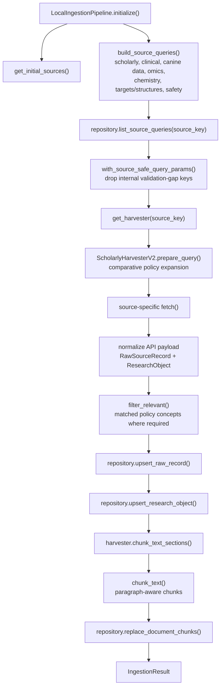

Notes:

- Harvesters collect and normalize; they do not reason.
- `ResearchObject.dedupe_key` and source identifiers are created in source
  normalizers.
- When a stored object already has full text, `LocalIngestionPipeline` avoids
  replacing it with a metadata-only refresh.

## 3. Scraper And Full-Text Lanes

Main modules:

| Module | Role |
| --- | --- |
| `harvesters_v2.py` | `EuropePMCHarvesterV2` and `PMCOAHarvesterV2` fetch legal full text, parse JATS body sections, and label chunks as `title_abstract` or `full_text:*`. |
| `scraper_bridge.py` | Controlled non-API bridge. Requires source profile review, URL allowlists, approval, immutable artifacts, parse review, and explicit ingest promotion. |
| `scrape_parsers.py` | Deterministic HTML parsers and manifest discovery for generic linked articles and AVMA VCTR pages. |
| `full_text_triage.py` | Classifies full-text failures into bounded actions such as retry, reduce batch size, parser fix, or license review. |
| `full_text_ops.py` | Recommend-only ops agent that combines source health, partition reports, and recent agent runs into schedule recommendations. |
| `structured_orchestration.py` | Runs full-text source pipelines and computes persisted/current-run full-text QA. |

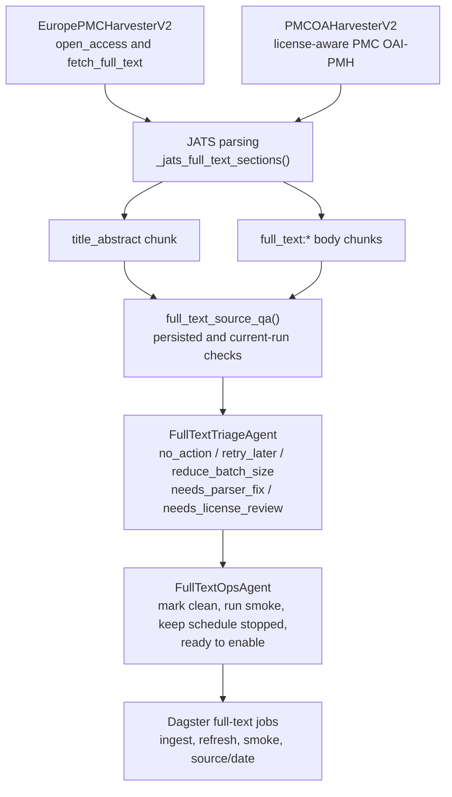

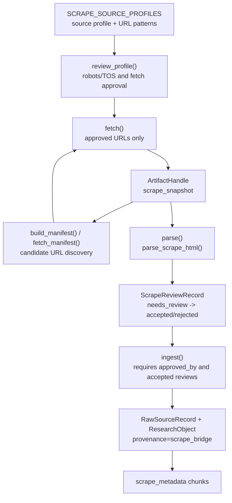

Notes:

- Full-text body chunks are kept distinct from `title_abstract` chunks.
- Source/date partitions use publication-date query params for full-text
  sources and allow clean empty partitions.
- The scraper lane is not a general crawler. It is profile-gated, review-gated,
  and promotion-gated.

## 4. Storage And Repository

Main modules:

| Module | Role |
| --- | --- |
| `contracts.py` | Pydantic contracts shared by MCP, service, Dagster, agents, and storage adapters. |
| `repository.py` | `ResearchRepository` protocol plus in-memory implementation and keyword/cosine helpers. |
| `local_store.py` | Default SQLite repository with source registry, raw records, objects, chunks, entities, claims, embeddings, agent runs, queues, artifacts, leads, and reports. |
| `postgres_store.py` | Postgres adapter preserving the repository contract for hosted runtime. |
| `storage.py` | Repository factory using `HSA_STORAGE_BACKEND`, `HSA_DATABASE_URL`, and local SQLite defaults. |
| `dagster_resources.py` | Dagster `ResearchRepositoryResource` for sqlite/postgres-backed jobs. |

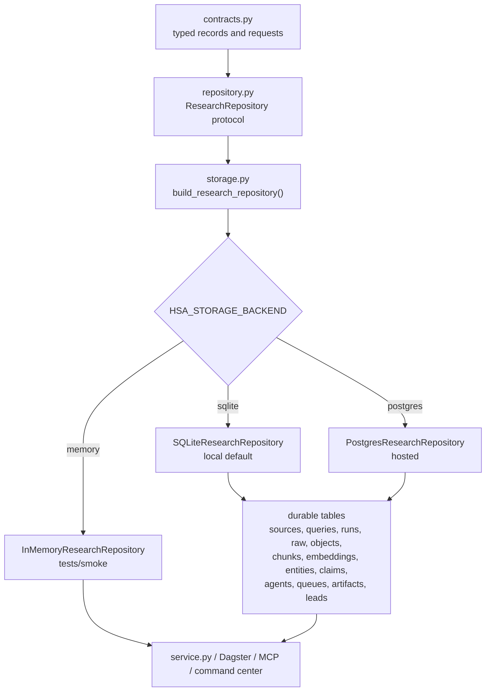

Notes:

- The repository stores typed JSON payloads plus query-friendly columns.
- `replace_document_chunks()` removes old chunks plus derived entity mentions
  and embeddings for the object being refreshed.
- Retrieval reads never expose raw embedding vectors through service/MCP tools.

## 5. Chunking, Entities, Claims, Curation, Embeddings

Main modules:

| Module | Role |
| --- | --- |
| `chunker.py` | Deterministic paragraph-aware chunking with stable content hashes. |
| `entity_resolution.py` | Local dictionary resolver plus optional PubTator annotations; persists canonical entities, aliases, and chunk mentions. |
| `claim_extractor.py` | Conservative local rule extractor over chunks and structured source metadata. |
| `claim_curator.py` | Deterministic curator that scores, dedupes, promotes, rejects, or marks claims for review. |
| `embeddings.py` | Local hash and OpenRouter embedding providers, embedding text builder, indexer, and orphan maintenance. |
| `structured_orchestration.py` | Source pipeline wrapper that chains ingestion, entity resolution, extraction, curation, and QA. |

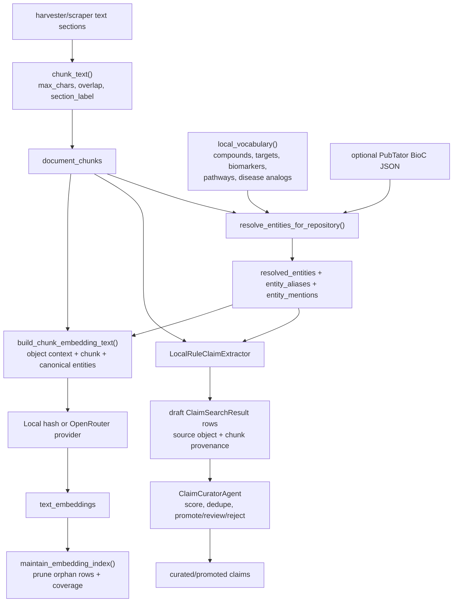

Notes:

- Entity IDs, alias IDs, mention IDs, and extractor claim IDs are deterministic.
- Claims remain low-confidence drafts until curation updates metadata and
  confidence.
- Active embedding model selection prefers `HSA_EMBEDDING_MODEL`, then
  OpenRouter large embeddings when `OPENROUTER_API_KEY` exists, then
  `local-hash-v1`.

## 6. Research Brief Agents And Evaluator

Main modules:

| Module | Role |
| --- | --- |
| `research_brief_agent.py` | Builds retrieval evidence bundles, runs perspective agents, and synthesizes final citation-first briefs. |
| `research_brief_evaluation.py` | Scores persisted briefs for citation coverage, perspective balance, contradiction handling, novelty, actionability, and transparency. |
| `agent_runner.py` | Persists agent run records before and after execution. |
| `research_brief_errors.py` | Splits hard errors from evidence limitations. |
| `service.py` | Orchestrates brief runs, persistence, evaluations, queue items, quality reports, and follow-up leads. |

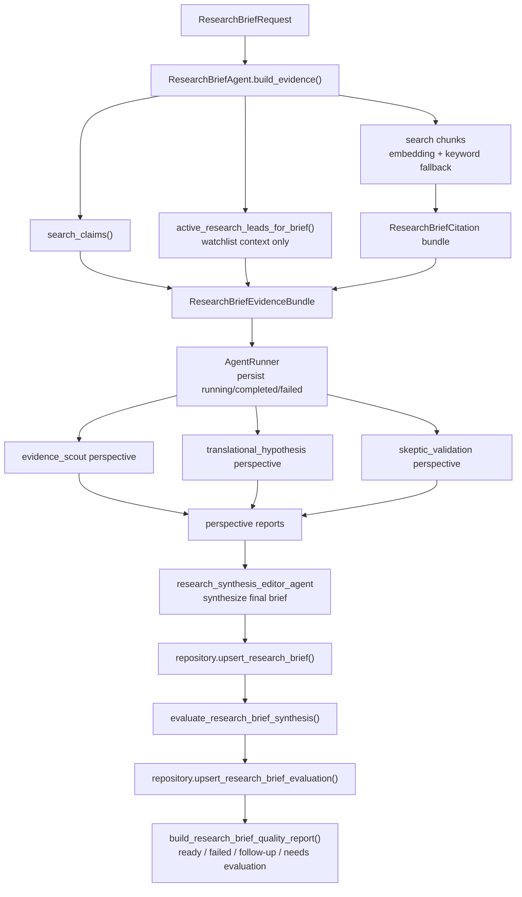

Notes:

- Perspective agents may run deterministically, produce external playground
  prompts, or call OpenRouter depending on review mode.
- Findings must use supplied citation IDs; research leads can inform open
  questions but cannot support findings.
- The evaluator gates downstream validation planning through
  `passes_quality_bar` and `readiness`.

## 7. Validation Planning, Queue, Agents, Autopilot

Main modules:

| Module | Role |
| --- | --- |
| `validation_planning.py` | Builds recommend-only validation plans from ready evaluated briefs. |
| `validation_agents.py` | Reviews approved validation queue items and returns promote/hold/demote decisions. |
| `service.py` | Queues validation requests, approves, dispatches, blocks missing context, and runs conservative autopilot. |
| `evidence_gap_resolver.py` | Converts validation-agent evidence gaps into research leads and optional brief queue items. |
| `validation_gap_source_pack.py` and `validation_gap_ingest.py` | Build and ingest targeted source-query packs for validation gaps. |

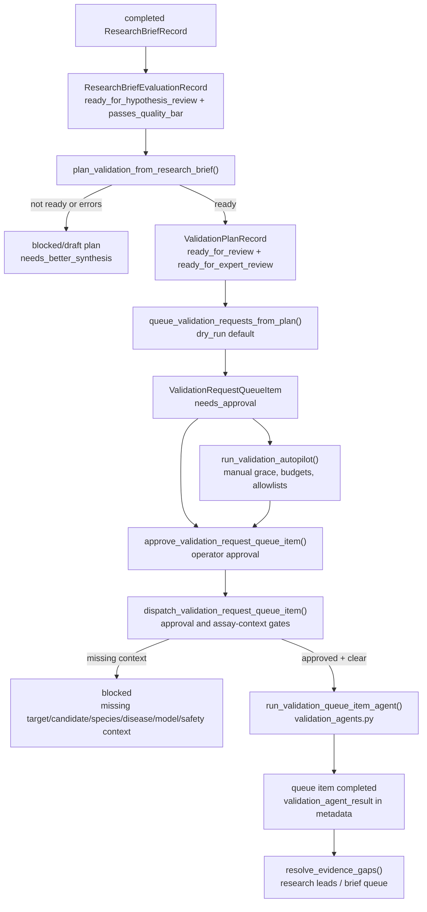

Notes:

- Creating a validation plan does not dispatch work.
- Queueing a validation request does not dispatch work.
- Dispatch requires explicit approval and execution context. `expert_review`
  is the only validation type exempt from dispatch blockers.
- Autopilot is intentionally narrow: it selects only `needs_approval` items,
  respects manual activity grace periods and budgets, skips risky execution
  types, and is stopped by default in Dagster.

## 8. Dagster Assets, Jobs, Schedules

Main modules:

| Module | Role |
| --- | --- |
| `dagster_assets.py` | Defines placeholder foundation assets, live report assets, asset checks, jobs, schedules, and `dg.Definitions`. |
| `dagster_resources.py` | Configurable repository resource for Dagster jobs. |
| `src/hsa_dagster/definitions.py` | Dagster+ entrypoint returning `ingestion_bridge_defs`. |

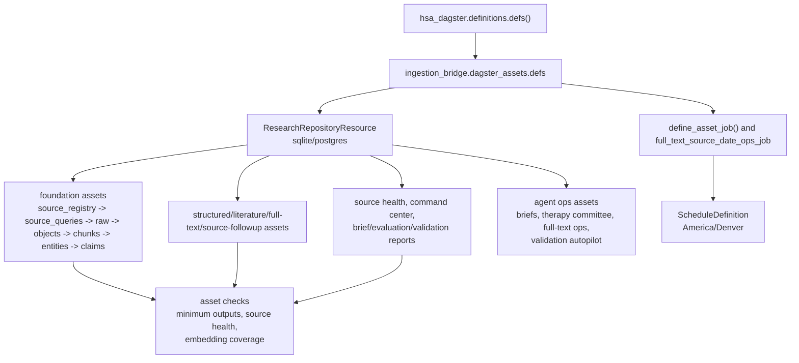

Live scheduled jobs in code:

| Schedule | Job | Cron | Default |
| --- | --- | --- | --- |
| `literature_corpus_daily_schedule` | `literature_corpus_harvest_job` | `0 1 * * *` | running |
| `literature_full_text_source_date_daily_schedule` | `literature_full_text_source_date_job` | `30 2 * * *` | running |
| `literature_full_text_weekly_schedule` | `literature_full_text_refresh_job` | `0 2 * * 0` | stopped |
| `structured_source_pipeline_weekly_schedule` | `structured_source_pipeline_job` | `0 2 * * 1` | running |
| `all_api_smoke_weekly_schedule` | `all_api_smoke_job` | `0 3 * * 2` | running |
| `source_followup_queue_daily_schedule` | `source_followup_queue_job` | `5 3 * * *` | running |
| `pubmed_source_followup_ingest_daily_schedule` | `pubmed_source_followup_ingest_job` | `20 3 * * *` | running |
| `crossref_source_followup_ingest_daily_schedule` | `crossref_source_followup_ingest_job` | `35 3 * * *` | running |
| `pmc_oa_source_followup_ingest_daily_schedule` | `pmc_oa_source_followup_ingest_job` | `50 3 * * *` | running |
| `clinicaltrials_gov_source_followup_ingest_daily_schedule` | `clinicaltrials_gov_source_followup_ingest_job` | `5 4 * * *` | running |
| `unpaywall_source_followup_ingest_daily_schedule` | `unpaywall_source_followup_ingest_job` | `20 4 * * *` | running |
| `research_leads_daily_schedule` | `research_leads_job` | `35 4 * * *` | running |
| `embedding_index_daily_schedule` | `embedding_index_job` | `0 5 * * *` | running |
| `embedding_maintenance_daily_schedule` | `embedding_maintenance_job` | `45 5 * * *` | running |
| `source_health_daily_schedule` | `source_health_report_job` | `15 6 * * *` | running |
| `validation_autopilot_hourly_schedule` | `validation_autopilot_job` | `0 * * * *` | stopped |

## 9. MCP Tools And Resources

Main modules:

| Module | Role |
| --- | --- |
| `mcp_server.py` | FastMCP server exposing service methods as typed tools and resources. |
| `service.py` | Shared implementation used by MCP, Dagster, CLI, and web command center. |
| `contracts.py` | Request/response validation at the tool boundary. |

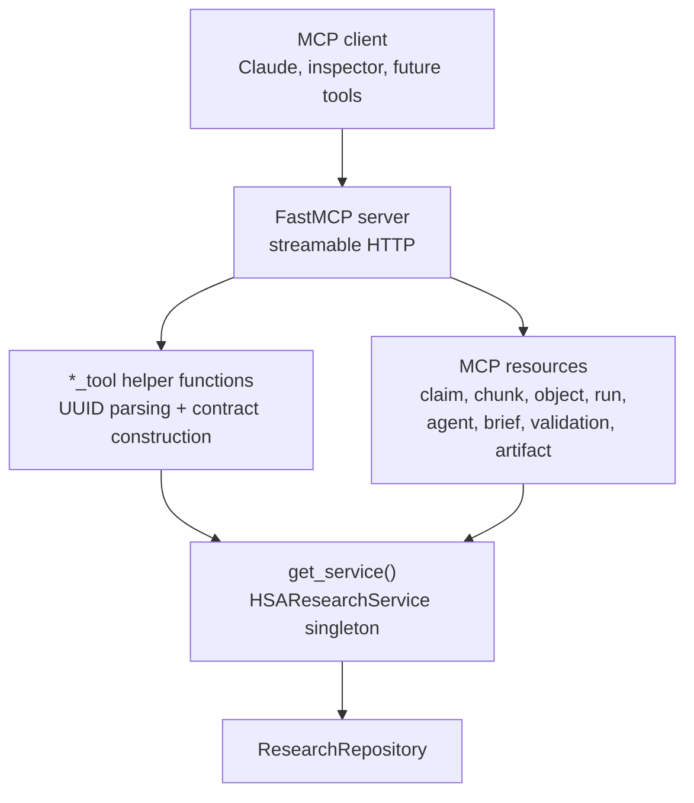

Tool groups:

| Group | Representative tools |
| --- | --- |
| Retrieval/read | `search_research_chunks`, `get_chunk_context`, `get_research_object`, `run_retrieval_smoke`, `search_claims` |
| Briefs/ideas | `run_research_brief`, `build_research_brief_playground_pack`, `run_therapy_committee`, brief list/get/evaluate tools |
| Validation | `plan_validation`, `queue_validation_requests`, validation queue list/get/approve/dispatch, `run_validation_autopilot` |
| Evidence gaps/leads | `resolve_evidence_gaps`, `build_validation_gap_source_pack`, `ingest_validation_gap_source_queries`, research lead tools, research followup resolver tools |
| Full text/social/followups | `triage_full_text_issue`, `run_full_text_ops`, X topic and linked-article review tools, source followup queue/ingest tools |
| Operations | `command_center`, `get_agent_run`, `list_agent_runs`, model profile tools |
| Legacy/async validation | `get_candidate`, `propose_hypothesis`, `commit_hypothesis`, `run_boltz`, `request_validation`, run/artifact reads |

Resources include `claim://{claim_id}`, `chunk://{chunk_id}`,
`research-object://{research_object_id}`, `run://{run_id}`,
`agent-run://{agent_run_id}`, `research-lead://{lead_id}`,
`research-brief://{brief_id}`,
`research-brief-evaluation://{evaluation_id}`,
`validation-plan://{plan_id}`,
`validation-request-queue://{queue_item_id}`,
`research-brief-queue://{queue_item_id}`, and
`artifact://{artifact_id}`.

## 10. Command Center Web

Main modules:

| Module | Role |
| --- | --- |
| `command_center_web.py` | Stdlib HTTP server over `HSAResearchService`; serves static assets and JSON APIs. |
| `command_center_static/index.html` | Operator layout for operations, briefs, and ideas pages. |
| `command_center_static/app.js` | Fetches API payloads, renders tables/cards, approves/dispatches validation requests, runs autopilot, and updates research lead status. |
| `command_center_static/styles.css` | Lightweight dashboard styling. |
| `service.py` | Builds command center reports, quality reports, lead updates, validation actions, and autopilot runs. |

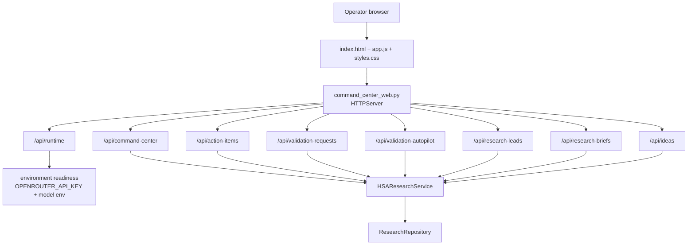

POST actions:

| Route shape | Action |
| --- | --- |
| `/api/validation-requests/{queue_item_id}/approve` | Approve one validation queue item. |
| `/api/validation-requests/{queue_item_id}/dispatch` | Dispatch one approved item, with OpenRouter readiness checked for live model profiles. |
| `/api/validation-autopilot/run` | Dry-run or apply one autopilot pass. |
| `/api/research-leads/{lead_id}/status` | Update a research lead lifecycle status. |

Notes:

- The command center is local-first and binds to `127.0.0.1:8787` by default.
- Runtime readiness intentionally exposes whether validation dispatch is
  configured without leaking secrets.
- The web UI is a thin operator surface over the same service contract used by
  MCP and Dagster.
