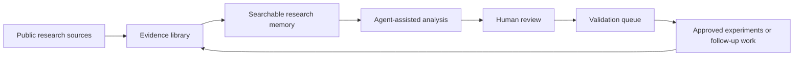
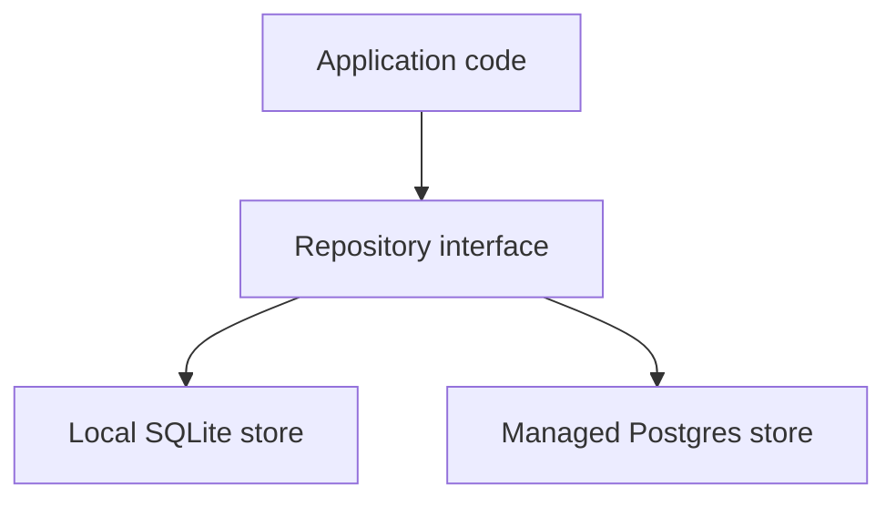
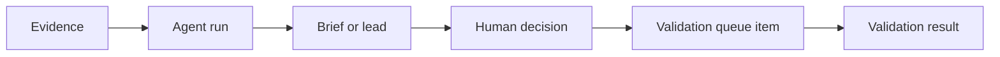
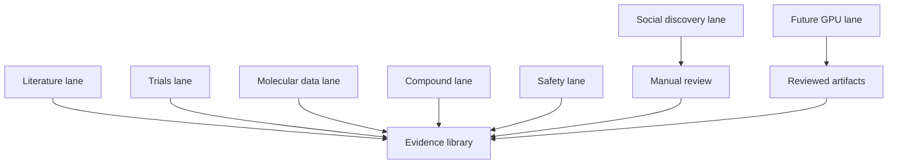
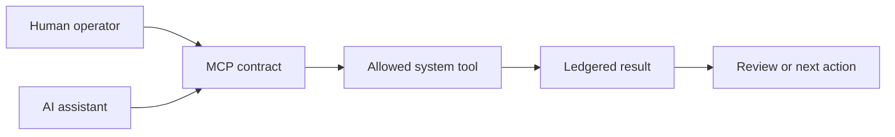
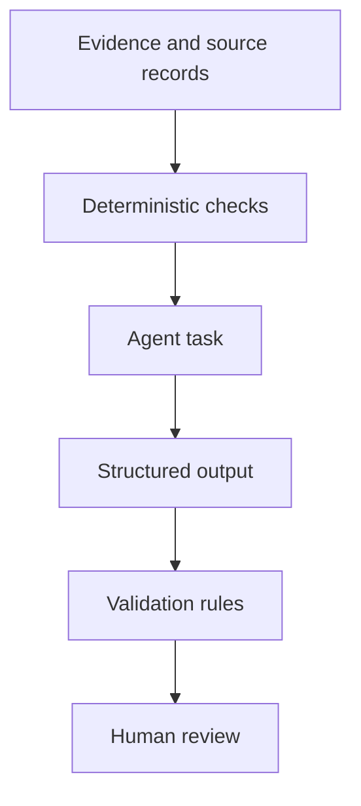
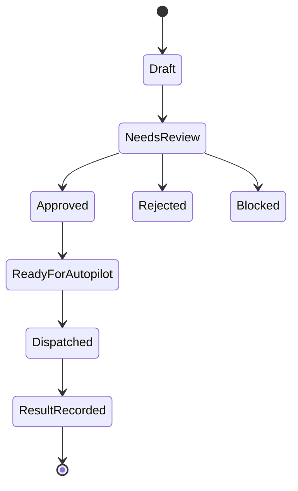
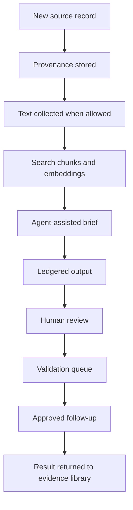

# TWOG v2 Non-Technical System Overview

Draft for collaborators, advisors, funders, clinicians, scientists, and operations partners who want to understand what TWOG / hsa-dagster v2 is, why it is being built this way, and how it can be trusted.

This document avoids implementation detail where possible. It is meant to sit beside the technical architecture, not replace it.

---

## The Short Version

TWOG v2 is a research operating system for comparative oncology, with an immediate focus on canine hemangiosarcoma and related human angiosarcoma research.

Its job is to help a small team do the kind of research coordination that usually requires a much larger organization:

- Find relevant biomedical evidence across many public sources.
- Keep a durable record of what was found, when, where it came from, and how it was processed.
- Make the evidence searchable by meaning, not just by keyword.
- Use AI agents carefully, with deterministic checks and human approval points.
- Turn promising findings into explicit validation plans instead of loose ideas.
- Give operators one command center where they can monitor, approve, pause, and audit the work.

The central idea is simple:

> Every useful claim should be traceable. Every automated action should be visible. Every risky step should have a human gate.

TWOG v2 is not a chatbot, not a clinical recommendation system, and not a substitute for scientific review. It is infrastructure for finding, organizing, ranking, and validating research leads.

---

## Why This System Exists

Canine hemangiosarcoma is urgent, under-served, and scientifically difficult. The relevant clues do not live in one place. They are scattered across journal abstracts, full-text papers, clinical trials, veterinary registries, molecular databases, compound databases, adverse event records, sequencing archives, and sometimes early signals from public discussion.

That creates three practical problems.

First, important evidence is easy to miss. A useful pathway, compound, dataset, or trial design may be named differently across sources. It may appear in a human angiosarcoma paper, a veterinary abstract, a sequencing dataset, a protein database, or a compound annotation.

Second, evidence can become detached from its source. A promising idea is not enough. The team needs to know exactly where it came from, whether the source is trusted, whether full text was legally available, whether the statement came from a title, abstract, body text, dataset, or generated summary, and whether the same idea appears elsewhere.

Third, AI can accelerate discovery but can also make research messier if it is not controlled. The goal is not to let an AI freewheel through scientific literature. The goal is to give AI narrow jobs, preserve its work, compare it against deterministic rules, and require human review before important actions.

TWOG v2 is designed around those realities.

---

## What The System Is Trying To Become

At full maturity, TWOG v2 is intended to function like a research control room.

It continuously gathers evidence, records provenance, finds connections, highlights promising leads, drafts validation plans, and tracks what has been reviewed or approved. Humans still decide what matters. The system makes those decisions easier, faster, and more auditable.

The loop matters. TWOG v2 is not only a collection tool. It is meant to create a disciplined cycle:

1. Gather evidence.
2. Preserve the source.
3. Compare it against the existing research picture.
4. Identify leads.
5. Review them.
6. Convert selected leads into validation work.
7. Feed results back into the system.

That cycle is the foundation for a durable research program.

---

## Why Dagster

Dagster is the system's orchestration layer. In plain language, it is the operations board that knows what work should run, what has already run, what succeeded, what failed, and what each step produced.

TWOG v2 has many recurring jobs:

- Pull literature records from biomedical indexes.
- Refresh trial registries.
- Check molecular databases.
- Ingest full text when allowed.
- Build search indexes.
- Dispatch agent reviews.
- Prepare validation queue items.
- Monitor command center state.

Without an orchestrator, those jobs become a tangle of scripts. They may run out of order, fail silently, duplicate work, or leave no reliable record. Dagster gives the project a structured way to run the work and see the state of the system.

The reason for using Dagster is not fashion or complexity. It is accountability.

Dagster helps answer practical questions:

- What ran today?
- What source did it use?
- Which records changed?
- Which step failed?
- Can we re-run only the failed part?
- What evidence was current when this brief or validation plan was created?

That is why Dagster is the right backbone for TWOG v2. It turns research automation into observable, repeatable operations.

---

## Why A Repository Abstraction

TWOG v2 needs to run in more than one setting.

Sometimes the system is used locally by a developer or researcher. Sometimes it runs in a hosted environment with a managed database. Sometimes it needs to support a lightweight review workflow. Later, it may need to coordinate larger compute jobs.

The repository abstraction is the layer that lets the system treat storage consistently across those environments.

In non-technical terms, it is like using the same library catalog whether the books are stored on a local shelf or in a larger institutional archive.

This matters for several reasons.

First, local work stays useful. A researcher can develop or inspect behavior without needing the full hosted setup.

Second, hosted work can scale. Managed Postgres is better suited for durable multi-user operation, richer querying, and production-style monitoring.

Third, the project avoids tying its scientific logic to one database shape too early. The same concepts, such as papers, source records, agent runs, briefs, validation plans, and queue items, can be handled through one consistent layer.

The design goal is portability with discipline. Local runs should be convenient. Hosted runs should be durable. Both should speak the same research language.

---

## Why Durable Ledgers

TWOG v2 stores more than final answers. It stores records of activity.

These durable ledgers include things like:

- Agent runs.
- Generated research briefs.
- Validation queue items.
- Validation plans.
- Source follow-up requests.
- Research leads.
- Operator decisions.

A ledger is important because research work needs memory. If an agent produces a useful hypothesis, the team should know what evidence it saw, what prompt or contract guided it, when it ran, and whether a human approved the next step. If a validation request is rejected, that decision should not disappear.

The ledger approach helps prevent a common failure mode in AI-assisted research: good-looking outputs with no history.

TWOG v2 instead treats each significant output as part of a visible chain.

The result is a system where the team can ask:

- Why did we believe this was promising?
- Who reviewed it?
- Was it approved, rejected, or deferred?
- What evidence supported it?
- Did later evidence strengthen or weaken it?

For a serious research program, that history is not optional. It is part of the scientific asset.

---

## Why Source Lanes

TWOG v2 does not treat all evidence as the same kind of thing.

A PubMed abstract, a clinical trial record, a compound database entry, an adverse event report, a sequencing dataset, and a social media post have very different meanings. They should not flow through the system as if they have equal authority.

That is why the architecture uses source lanes.

A source lane is a dedicated path for one category of evidence. Each lane has its own rules for ingestion, labeling, provenance, and review.

The current and planned lanes include:

- Literature indexes such as PubMed, Europe PMC, OpenAlex, Crossref, and PMC Open Access.
- Clinical and veterinary trial sources such as ClinicalTrials.gov and the AVMA Veterinary Clinical Trials Registry.
- Comparative oncology and cancer data sources such as ICDC.
- Sequencing and expression resources such as GEO and SRA.
- Compound and biology resources such as PubChem, ChEMBL, UniProt, and RCSB PDB.
- Safety-related sources such as openFDA animal adverse event records.
- X/Twitter monitoring as a manual-review discovery lane, not an evidence authority.
- A future GPU lane for heavier computational analysis.

The reason for separating lanes is trust. Each source type needs context.

For example, a trial registry can indicate clinical activity, but it does not prove efficacy. A compound database can show known biology, but it does not prove relevance to hemangiosarcoma. A social post may point to an emerging conversation, but it is not scientific evidence. A sequencing dataset may be valuable, but only after careful interpretation.

Source lanes let the system preserve those differences instead of flattening them.

---

## Why Embeddings

Traditional search is good at exact words. Biomedical research often requires something more flexible.

The same idea may appear under different names:

- A pathway name.
- A gene symbol.
- A drug class.
- A protein target.
- A tumor biology phrase.
- A trial eligibility phrase.

Embeddings help the system search by meaning. They turn chunks of text into mathematical representations that can be compared for similarity. For a non-technical reader, the simplest way to think about embeddings is this:

> Embeddings give the evidence library a research memory that can recognize related ideas even when the wording changes.

This is useful for questions like:

- Which papers discuss biology similar to this lead?
- Are there human angiosarcoma findings that resemble canine hemangiosarcoma evidence?
- Which compounds appear near the same pathways or targets?
- Has a proposed mechanism shown up in trial descriptions or dataset annotations?

Embeddings are not proof. They do not decide what is true. They help retrieve relevant material so humans and agents can examine it.

That distinction is central. In TWOG v2, embeddings support discovery. They do not replace validation.

---

## Why MCP Contracts

MCP stands for Model Context Protocol. The phrase is technical, but the idea is straightforward.

MCP gives AI assistants and other tools a standard doorway into the system. Instead of letting every assistant invent its own way to query evidence, request briefs, or submit validation ideas, MCP defines explicit contracts.

In plain language, an MCP contract says:

- Here is what this tool is allowed to do.
- Here is the shape of the request.
- Here is the shape of the response.
- Here is what must be recorded.
- Here is what still requires human approval.

This matters because TWOG v2 is not meant to depend on one chat interface or one AI provider. The system should be able to expose carefully controlled capabilities to different assistants, dashboards, and workflows.

MCP keeps those capabilities legible.

The design rationale is safety through explicit boundaries. Agents can be useful, but only when their permissions and outputs are clear.

---

## Why A Command Center

The command center is the operator-facing surface for TWOG v2.

It exists because a research automation system should not be invisible. Operators need to see what is happening, what is waiting, what failed, what needs review, and what has been approved.

The command center is the difference between "automation is running somewhere" and "the team understands the state of the program."

It is expected to support views such as:

- Recent ingestion activity.
- Source status.
- Agent runs and generated briefs.
- Validation queue items.
- Autopilot readiness.
- Manual approval decisions.
- Follow-up requests.
- System health.

For non-technical users, the command center is the cockpit. It does not contain all the machinery, but it shows the information needed to steer.

The reason this matters is confidence. If a system is making suggestions that may influence research priorities, the team needs more than outputs. It needs visibility into how those outputs were produced and what still needs judgment.

---

## Why OpenRouter-Backed Agents With Deterministic Floors

TWOG v2 uses AI agents for tasks that benefit from language understanding, synthesis, comparison, and drafting. OpenRouter-backed agents allow the system to route selected tasks through external large language models when appropriate.

But the architecture does not treat AI as the foundation of truth.

The phrase "deterministic floors" means the system keeps simple, repeatable, non-AI checks underneath the AI layer. These checks can include rules, schemas, required fields, source filters, queue states, approvals, and conservative blockers.

That gives the system a floor that does not move when an AI model changes.

The design is intentionally layered:

- Deterministic systems handle what must be consistent.
- AI agents handle what benefits from synthesis.
- Humans approve what carries scientific, operational, or budget risk.

This is safer than asking a general chatbot to "find promising treatments." TWOG v2 narrows the task, logs the run, checks the output, and routes important next steps through review.

---

## What AI Does And Does Not Do

AI can help TWOG v2 move faster in specific ways.

It can:

- Summarize a cluster of papers.
- Compare a new finding to existing evidence.
- Draft a lead brief.
- Suggest why a lead may be worth follow-up.
- Help format a validation plan.
- Flag missing information.
- Translate technical evidence into operator-friendly language.

It should not:

- Make clinical recommendations.
- Decide that a compound works.
- Treat a social post as scientific evidence.
- Run expensive or risky workflows without approval.
- Hide uncertainty.
- Replace human review.

The goal is not to remove human judgment. The goal is to aim human judgment at the highest-value questions.

---

## Why A Validation Queue

Research ideas need a place to go.

Without a validation queue, promising leads can remain trapped in notes, chats, spreadsheets, or memory. TWOG v2 creates an explicit place for candidate follow-up work.

A validation queue item can capture:

- What is being proposed.
- Why it matters.
- What evidence supports it.
- What assumptions need testing.
- What type of validation may be appropriate.
- Whether it is ready, blocked, approved, rejected, or deferred.
- What human decision was made.

The validation queue is the bridge between discovery and action.

This is especially important in a small organization. It makes the research program less dependent on informal memory and more dependent on visible, reviewable priorities.

---

## Why Autopilot Is Conservative

The word "autopilot" can sound like a system acting alone. In TWOG v2, autopilot is designed to be conservative.

Autopilot should mean:

- The system can prepare work.
- The system can check whether required fields are present.
- The system can identify blockers.
- The system can dispatch approved, low-risk tasks.
- The system records what it did.

Autopilot should not mean:

- The system makes scientific decisions on its own.
- The system spends budget without controls.
- The system bypasses human approval.
- The system treats generated analysis as validated truth.

The architecture supports dry runs, approval gates, explicit blockers, and queue states so automated workflows remain manageable.

In other words, TWOG v2 is not trying to create reckless automation. It is trying to create disciplined automation that humans can trust.

---

## Why Full-Text Hardening Matters

Scientific claims become more useful when the system can inspect full text, not only titles and abstracts.

But full text must be handled carefully.

TWOG v2 distinguishes between source types and text locations. A sentence from a paper body is different from a title. A statement from an abstract is different from a method section. A legally available open-access article is different from content the system is not allowed to store.

Full-text hardening means the system is designed to:

- Track where text came from.
- Respect licensing and availability.
- Separate title, abstract, and body text.
- Preserve parser and source metadata.
- Avoid mixing unreliable text into higher-trust evidence fields.
- Make downstream search and agent work aware of source quality.

This is not a minor detail. If TWOG v2 is going to support serious research decisions, it must avoid turning messy text into false confidence.

Full-text hardening is how the system makes richer evidence safer to use.

---

## Why X/Twitter Monitoring Exists, And Why It Is Limited

X/Twitter monitoring is included as a discovery lane, not as a scientific evidence lane.

Public discussion can sometimes reveal useful signals:

- A new paper being discussed by researchers.
- A trial announcement.
- A conference presentation.
- A dataset release.
- A patient advocacy conversation that points to an information gap.

But social posts are not proof. They are not peer review. They can be incomplete, promotional, wrong, or missing context.

That is why TWOG v2 treats this lane carefully:

- It is manual-review oriented.
- It is disabled or controlled by default.
- It can suggest follow-up, not establish truth.
- It should route anything important back to primary sources.

The point is not to let social media drive the science. The point is to avoid missing early signals while still requiring stronger evidence before action.

---

## Why A Future GPU / RunPod Lane

Some future research tasks may require heavier compute than a normal application server should handle.

Examples could include:

- Large-scale embedding refreshes.
- Molecular or structural analysis.
- High-volume dataset processing.
- Model-assisted analysis that benefits from GPU acceleration.

The architecture anticipates a future GPU lane, potentially using services such as RunPod, but keeps that lane separate from the core system.

The design principle is:

> Dagster coordinates heavy compute. It should not become the heavy compute environment itself.

That means the system can submit jobs, track status, collect artifacts, and record results without turning the main application into a fragile compute cluster.

GPU outputs should enter the evidence system as reviewed artifacts. They should not automatically become scientific conclusions. The same rule applies: results need provenance, review, and clear status.

---

## The Evidence Journey

A useful way to understand TWOG v2 is to follow one piece of evidence.

Imagine a new paper appears that may relate to hemangiosarcoma biology.

1. A source lane discovers the record.
2. The system stores the source metadata and where it came from.
3. If allowed, additional text is collected and labeled.
4. The content is chunked for search.
5. Embeddings make it findable by related meaning.
6. A deterministic process checks required fields and source status.
7. An agent may summarize or compare it against other evidence.
8. The output is stored in a ledger.
9. A human reviews the result.
10. If promising, a validation queue item is created.
11. Follow-up work is approved, deferred, blocked, or rejected.
12. Any results return to the evidence library.

This journey shows the basic philosophy: evidence enters carefully, analysis is recorded, and action is gated.

---

## What Makes This Different From A Knowledge Base

A knowledge base stores information. TWOG v2 does more than that.

It combines:

- Evidence intake.
- Provenance tracking.
- Search by meaning.
- Agent-assisted synthesis.
- Human review.
- Queue-based validation planning.
- Operational monitoring.
- Durable records of decisions.

The difference is actionability. A normal knowledge base may help someone find a paper. TWOG v2 is designed to help the team ask what should happen next, who should review it, and how the decision should be recorded.

That is why the architecture includes ledgers, queues, command center views, MCP contracts, and conservative autopilot pathways. Those pieces are not decorative. They are what turn information into an operating system.

---

## What Makes This Different From A Chatbot

A chatbot conversation is usually temporary, flexible, and difficult to audit.

TWOG v2 is built around persistence, structure, and review.

| Chatbot Pattern | TWOG v2 Pattern |
| --- | --- |
| A user asks a broad question | The system runs defined tasks against known sources |
| Outputs live in a conversation | Outputs are recorded in durable ledgers |
| Source handling may be inconsistent | Provenance is part of the data model |
| The model decides how to answer | Agents operate under contracts and schemas |
| Follow-up may be informal | Leads move into a validation queue |
| Hard to inspect later | Command center and ledgers expose history |

The system can still use AI. The difference is that AI is placed inside a controlled research workflow.

---

## The Human Role

TWOG v2 is designed around human leadership.

Humans decide:

- Which research questions matter most.
- Which evidence is compelling.
- Which leads are worth validating.
- Which automated actions are allowed.
- Which results change priorities.
- Which uncertainties remain.

The system helps by doing work that machines are good at:

- Watching many sources.
- Remembering what changed.
- Preserving links and metadata.
- Retrieving related evidence.
- Drafting summaries.
- Checking required fields.
- Keeping queues organized.

The strongest version of TWOG v2 is not "AI replaces researchers." It is "a small research team gets institutional memory, better operations, and faster synthesis."

---

## Trust Principles

The architecture is guided by a few trust principles.

### 1. Keep The Source Attached

Evidence should not float free from where it came from. Source, date, lane, text location, parser status, and availability should remain visible.

### 2. Separate Discovery From Validation

Finding something interesting is not the same as proving it matters. TWOG v2 keeps discovery, review, and validation as separate stages.

### 3. Use AI For Synthesis, Not Authority

AI can summarize, compare, and draft. It should not become the final authority on scientific truth.

### 4. Make Automation Reviewable

Automated work should create records that humans can inspect. Silent automation is not acceptable for this kind of research program.

### 5. Preserve Negative And Deferred Decisions

Rejected or blocked ideas are still useful. They prevent the team from repeating the same work and help explain how priorities evolved.

### 6. Build For Local And Hosted Use

The system should remain useful on a local machine while also supporting a durable hosted deployment.

### 7. Make Future Scale Boring

Adding heavier compute, new source lanes, or more agents should fit the existing operating model instead of forcing a redesign.

---

## What Is Built Now Versus What This Enables

TWOG v2 is being built as a foundation. Some pieces are present as working code, some are active design surfaces, and some are planned extension lanes.

Current or near-current foundation:

- Dagster-centered orchestration.
- Local and Postgres-backed storage abstraction.
- Source ingestion lanes.
- Command center surfaces.
- Durable records for agent and validation activity.
- Validation queue concepts.
- MCP-facing contracts.
- Embedding-based retrieval patterns.
- OpenRouter-enabled agent dispatch pathways with approval-oriented controls.

Active hardening areas:

- Full-text ingestion quality and licensing boundaries.
- Stronger source partitioning and provenance labels.
- Validation queue ergonomics.
- Autopilot dry-run and approval behavior.
- Command center visibility.
- X/Twitter monitoring as a constrained discovery lane.

Future expansion:

- GPU-backed analysis lane.
- More sophisticated comparative oncology analysis.
- Richer validation result tracking.
- More advanced operator review workflows.
- Larger hosted deployments.

The important point is that the architecture is not only for today's scripts. It is meant to support a research operating model that can grow.

---

## A Plain-Language Map Of The Major Parts

| Part | Plain-language role | Why it matters |
| --- | --- | --- |
| Dagster | The operations board | Runs work in order and records what happened |
| Source lanes | Dedicated evidence paths | Keeps different evidence types from being mixed together |
| Repository abstraction | Shared storage language | Lets local and hosted deployments use the same concepts |
| Postgres | Durable hosted library | Supports production-style storage and querying |
| Local database | Researcher workbench | Makes development and inspection easier |
| Ledgers | System memory | Preserves actions, outputs, decisions, and history |
| Embeddings | Meaning-based search memory | Finds related ideas even when wording differs |
| MCP contracts | Controlled tool doorway | Lets assistants interact with the system safely |
| Command center | Operator cockpit | Shows status, queues, approvals, and health |
| Agents | Research assistants | Summarize, compare, draft, and structure work |
| Deterministic floors | Stable guardrails | Keep basic checks consistent below AI outputs |
| Validation queue | Action pipeline | Turns leads into reviewable follow-up work |
| Autopilot | Controlled execution helper | Runs approved low-risk tasks and records results |
| Full-text hardening | Evidence quality protection | Keeps richer text useful without losing context |
| X/Twitter lane | Early signal monitor | Helps discover conversations but does not prove claims |
| GPU / RunPod lane | Future heavy-compute path | Supports larger analyses without overloading the core app |

---

## What Success Looks Like

TWOG v2 is successful if it helps the team answer hard questions with more speed and less ambiguity.

Examples:

- "What evidence supports this lead?"
- "Has a similar mechanism appeared in human angiosarcoma?"
- "Which sources changed this week?"
- "Which validation ideas are approved but not dispatched?"
- "Which agent summaries need review?"
- "What did we reject, and why?"
- "Can we trace this recommendation back to source records?"
- "Are we treating social signals separately from scientific evidence?"
- "Can a new collaborator understand the state of the program quickly?"

The best outcome is not just more data. It is better research continuity.

---

## Risks The Architecture Is Designed To Reduce

Every ambitious research system has risks. TWOG v2 is designed to reduce several specific ones.

### Risk: AI Overconfidence

Mitigation: Use agents for structured tasks, keep deterministic checks underneath, store outputs in ledgers, and require human review for consequential steps.

### Risk: Source Confusion

Mitigation: Use source lanes, provenance fields, text location labels, and full-text hardening.

### Risk: Lost Context

Mitigation: Store briefs, validation plans, agent runs, source follow-ups, and decisions durably.

### Risk: Uncontrolled Automation

Mitigation: Use approval gates, queue states, blockers, dry runs, and command center visibility.

### Risk: Scaling Too Early In The Wrong Shape

Mitigation: Keep the storage layer portable, keep Dagster as the coordinator, and isolate future heavy compute into a separate lane.

### Risk: Treating Discovery As Proof

Mitigation: Separate discovery, review, validation, and result recording.

---

## Why This Architecture Fits TWOG

TWOG needs a system that is ambitious but careful.

The research space is broad enough to need automation. The stakes are high enough to require human review. The evidence is scattered enough to need source lanes and embeddings. The program is young enough to need local flexibility. The future is large enough to need hosted storage, durable ledgers, and heavier compute options.

That combination points to a system with three qualities:

- It must be curious enough to discover unexpected connections.
- It must be disciplined enough to preserve provenance and decisions.
- It must be practical enough for a small team to operate.

Dagster, Postgres/local repositories, durable ledgers, source lanes, embeddings, MCP contracts, command center workflows, constrained agents, validation queues, and future compute lanes all serve that same purpose.

They are not separate ideas. They are parts of one operating model:

> Build a research engine that can search widely, remember carefully, act conservatively, and learn over time.

---

## Glossary

### Agent

An AI-assisted worker assigned to a specific task, such as summarizing evidence or drafting a validation brief.

### Autopilot

A controlled workflow mode where approved tasks can be prepared or dispatched with clear records, blockers, and review boundaries.

### Command Center

The operator-facing dashboard for monitoring system status, queues, agent activity, approvals, and health.

### Dagster

The orchestration system that runs and tracks repeatable research workflows.

### Deterministic Floor

The stable layer of non-AI checks and rules that keeps behavior consistent even when AI models vary.

### Durable Ledger

A persistent record of important system activity, such as agent runs, briefs, validation plans, queue items, and decisions.

### Embedding

A meaning-based representation of text that helps the system find related evidence even when different words are used.

### MCP Contract

A defined interface that controls how assistants or tools can interact with TWOG v2.

### Postgres

The database used for durable hosted storage.

### Repository Abstraction

The storage layer that lets the same system concepts work across local and hosted databases.

### Source Lane

A dedicated path for one category of evidence, with its own rules for ingestion, labeling, and review.

### Validation Queue

The structured place where promising leads become reviewable follow-up plans.

---

## Closing Frame

TWOG v2 is best understood as infrastructure for scientific judgment.

It does not try to make the hard decisions disappear. It tries to make the evidence clearer, the history more durable, the next steps more explicit, and the automation more accountable.

For a field where important signals are scattered and time matters, that operating system can become a real advantage.
