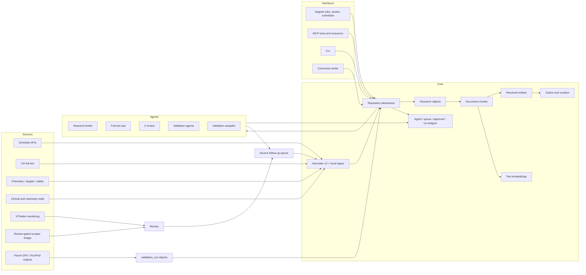
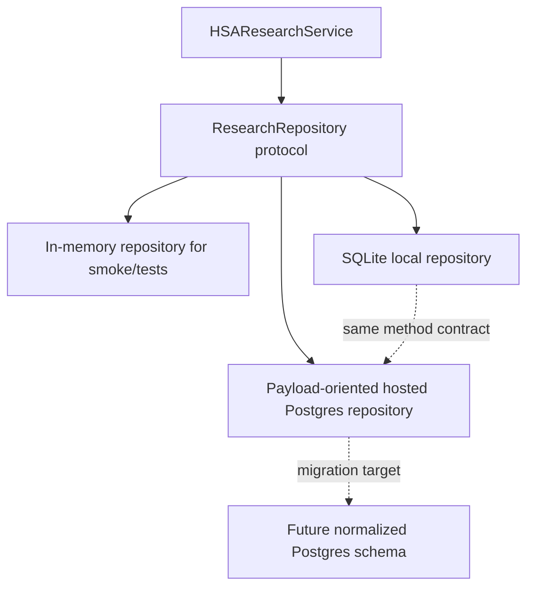
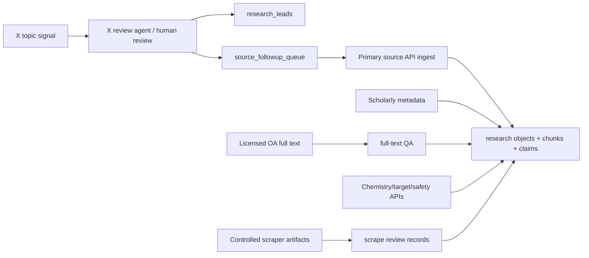
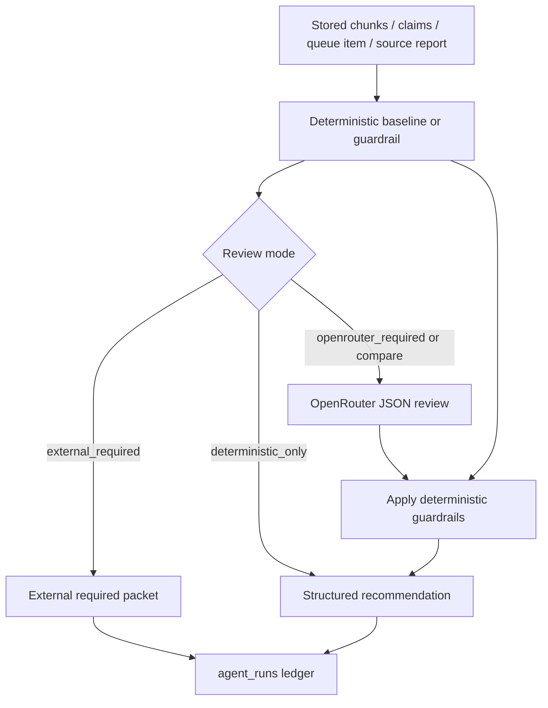
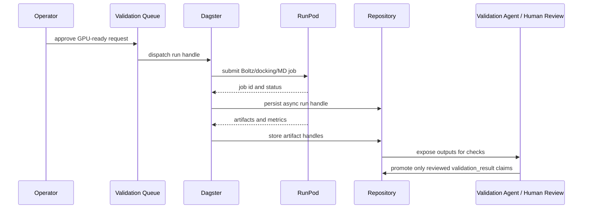
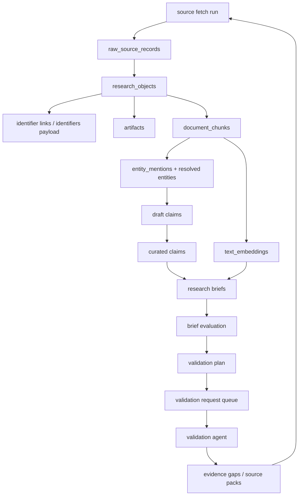

# TWOG / HSA Dagster v2 System Architecture

Status: draft architecture rationale
Project: TWOG HSA AutoResearch v2 / `hsa-dagster`
Last reviewed against repo: 2026-05-04

## Purpose

TWOG v2 is research infrastructure for canine hemangiosarcoma and human
angiosarcoma comparative oncology. The system is designed to ingest evidence,
preserve provenance, retrieve context, run bounded agents, queue validation
work, and expose operator controls without letting model output silently become
durable scientific truth.

The central design choice is to treat the system as a research object factory,
not a paper summarizer. Papers are one input. Trials, datasets, compound
records, assay rows, protein records, safety reports, social discovery signals,
validation outputs, and internal briefs also become typed objects when they can
be audited.

The operating principle is:

```text
source -> raw record -> research object -> chunks -> entities -> claims
  -> retrieval / briefs / validation queues -> reviewed durable decisions
```

Agents can suggest, review, synthesize, and route work. Durable knowledge comes
from stored records, chunks, claims, queue items, ledgers, and approvals.

## Current Shape

The repo already has the main v2 spine:

- Dagster definitions in `src/hsa_research/ingestion_bridge/dagster_assets.py`.
- Typed contracts in `src/hsa_research/ingestion_bridge/contracts.py`.
- Repository boundary in `repository.py`, implemented by local SQLite and hosted
  Postgres adapters.
- Local ingestion in `local_ingest.py` over v2 harvesters.
- MCP server in `mcp_server.py`.
- Service boundary in `service.py`.
- Durable agent run ledger through `agent_runner.py`.
- Embedding indexing and maintenance in `embeddings.py`.
- Full-text QA/triage/ops lanes.
- X/Twitter topic monitoring and linked-article follow-up lanes.
- Research brief, therapy committee, validation planning, validation queue,
  autopilot, source follow-up, research lead, command center, and source health
  surfaces.

Some pieces are intentionally scaffolded or future-facing. The normalized SQL
migration in `db/migrations/005_ingestion_bridge_v2.sql` describes a richer
Postgres target, while the current hosted Postgres adapter mirrors the proven
payload-oriented SQLite runtime contract. RunPod/GPU execution is represented
by async run handles and validation contracts, but the actual external compute
lane is not yet wired as a worker.

## Architecture At A Glance



## Why Dagster

Dagster is the right orchestration layer because this system is mostly
long-lived data operations, not one-off chat calls. Each lane needs typed
inputs, rerunnable jobs, visible materializations, checks, schedules, and
runtime metadata. The repo uses Dagster for exactly that:

- Scheduled ingestion and source health jobs run independently on a known
  cadence instead of as hidden background loops.
- Full-text source/date partitions make slow or flaky open-access sources
  debuggable one slice at a time.
- Asset checks enforce minimum outputs for structured sources, full-text
  health, entity resolution, and embedding coverage.
- Hosted Dagster+ gives an operator-visible run ledger and failure surface
  without forcing the research service itself to become a workflow engine.
- Manual jobs expose higher-risk lanes such as full-text ops, X topic review,
  validation planning, source follow-up, and validation autopilot without
  turning them on as silent automations.

Dagster is deliberately not the owner of business logic. The executable assets
build a repository resource and call service/orchestration functions. That keeps
the same behavior available from CLI, MCP, tests, and the command center.

## Why The Repository Abstraction Exists

The repository protocol is the system's stability layer. It keeps storage
implementation details behind typed operations such as:

- `upsert_raw_record`
- `upsert_research_object`
- `replace_document_chunks`
- `search_claims`
- `upsert_text_embedding`
- `list_agent_runs`
- `upsert_validation_request_queue_item`
- `list_source_followups`
- `upsert_research_lead`

This abstraction exists because local development and hosted orchestration have
different durability needs:

- SQLite is fast, dependency-light, and good for local development, contract
  tests, command-center work, and offline smoke paths.
- Hosted Dagster+ workers need managed Postgres because local worker disks are
  not durable.
- The current Postgres adapter intentionally mirrors the SQLite payload schema,
  so hosted behavior can stabilize before the richer normalized migration is
  adopted.
- The normalized migration remains a design target for stronger relational
  queryability, indexes, and provenance tables after adapter behavior is proven.

The tradeoff is intentional. Payload-oriented tables are less elegant than a
fully normalized schema, but they keep the typed service contract moving while
the scientific workflow is still changing.



## Why Durable Ledgers

The project avoids depending on an external LLM observability platform in this
phase. Instead, it stores the operational facts it needs for audit and replay:

- `agent_runs` records model profile, input payload, output payload, summary,
  status, errors, source key, partition date, and Dagster run ID.
- research brief ledgers store persisted generated briefs.
- research brief queue rows track queued, running, completed, failed, and
  archived synthesis work.
- validation plans and validation request queue rows preserve the handoff from
  synthesis to reviewable validation tasks.
- source follow-up queue rows track DOI, PMID, PMCID, NCT, and other identifier
  follow-ups from social, scrape, and agent review lanes.
- research leads store watchlist items that are not yet durable evidence.
- async run handles model future Dagster, RunPod, MCP, local, and external runs.
- approval metadata records who approved dispatch and why.

The reason for this design is scientific accountability. A brief, hypothesis,
or validation plan should be traceable back to stored chunks and citations. A
model review should be traceable back to the exact payload and guardrails used.
A failed source or validation dispatch should remain visible until an operator
understands it.

## Why Source Lanes

The repo separates sources by evidence boundary instead of using one generic
ingestion path. This is especially important in comparative oncology because
each source class can and cannot prove different things.

Current lanes include:

- Scholarly metadata: PubMed, Europe PMC, OpenAlex, Crossref, and Unpaywall.
- Open-access full text: Europe PMC and PMC OA, with legal/full-text gates.
- Clinical and veterinary trials: ClinicalTrials.gov and AVMA VCTR.
- Canine/omics data: ICDC, GEO, and SRA metadata.
- Chemistry: PubChem and ChEMBL.
- Targets and structures: UniProt and RCSB PDB.
- Safety: openFDA animal adverse events.
- Social discovery: disabled-by-default X topic monitoring.
- Review-gated scraping: AVMA detail snapshots and X-linked article follow-up.
- Validation-gap source queries: targeted follow-up queries generated from
  missing evidence in validation work.

The why is precision. PubChem can support compound identity but not efficacy.
openFDA animal events can support a safety signal but not incidence or
causality. X posts can discover leads but should not become scientific evidence.
Full-text sources can support body-text claims only when licensing and parser
checks pass. Source lanes keep those boundaries encoded in query policy,
contracts, QA, and curation.

The comparative query policy is also centralized. Scholarly lanes are expected
to include canine HSA, human angiosarcoma, and close vascular sarcoma analogs by
default. This prevents the system from becoming a canine-only silo and supports
the translational goal.



## Why Embeddings

The research brief and MCP read paths need more than keyword search, but the
repo avoids making vector infrastructure a deployment prerequisite too early.
The current embedding layer stores typed `TextEmbedding` rows for
`DocumentChunk` records and searches JSON vectors with cosine similarity in
Python.

The design has three reasons:

- Retrieval should be a durable storage contract, not an invisible agent memory.
- Local tests and fallback behavior need deterministic embeddings that work
  without network or API keys.
- Hosted retrieval should be able to use real semantic embeddings through
  OpenRouter when `OPENROUTER_API_KEY` is configured.

The system therefore supports:

- `local-hash-v1`, a dependency-free deterministic feature-hash provider.
- `openrouter:openai/text-embedding-3-small`.
- `openrouter:openai/text-embedding-3-large`, currently the preferred hosted
  default when OpenRouter is available.
- Embedding text that includes chunk text plus object context, identifiers, and
  resolved entity mentions.
- Idempotent reindexing by embedding input hash.
- Orphan cleanup and active-model coverage checks.
- Retrieval tools that return chunks and object context, never raw vectors.

The embedding lane gives agents a way to find relevant stored evidence while
keeping the evidence itself auditable.

## Why MCP Contracts

MCP is the public contract for LLMs and human-operated clients. The repo exposes
read, draft, write, and async-compute style tools over the service layer. That
lets Claude, OpenAI, Codex, local operators, or future collaborators use the
same typed boundaries instead of calling storage directly.

Important MCP surfaces include:

- Retrieval reads: `search_research_chunks`, `get_chunk_context`,
  `get_research_object`, and `run_retrieval_smoke`.
- Claim and candidate reads: `search_claims`, `get_candidate`.
- Brief and therapy workflows: `run_research_brief`,
  `build_research_brief_playground_pack`, `run_therapy_committee`, persisted
  brief/evaluation reads, and queue runners.
- Validation workflows: `plan_validation`, `queue_validation_requests`,
  `approve_validation_request`, `dispatch_validation_request`, and
  `run_validation_autopilot`.
- Follow-up workflows: source follow-up queue/ingest, research leads,
  evidence-gap resolution, validation-gap source packs, and X review lanes.
- Async compute contracts: `run_boltz`, `request_validation`,
  `get_run_status`, and `get_artifact`.

MCP resources expose durable object URLs such as `claim://`, `chunk://`,
`research-object://`, `agent-run://`, `research-brief://`,
`validation-plan://`, `validation-request-queue://`, and `artifact://`.

The rationale is safety by interface. Tools can cap result counts, hide raw
vectors, preserve approvals, return run handles for expensive work, and make
contract violations testable.

## Why The Command Center

The command center is the operator cockpit. It exists because a research system
with agents, queues, schedules, and source health cannot be operated only from
terminal commands or Dagster materialization pages.

The current command-center layer is intentionally lightweight: a stdlib HTTP
server over `HSAResearchService` plus bundled static assets. It reports:

- source health and recommendations,
- research brief queue state,
- research leads,
- recent agent runs,
- action items,
- validation request queue rows,
- validation autopilot previews/runs,
- persisted briefs and idea records.

It also exposes controlled actions such as lead status changes, validation
approval, validation dispatch, and one-shot autopilot execution. Runtime
readiness checks hide secrets and simply report whether OpenRouter-backed
dispatch is available.

The why is operational clarity. The system should tell the operator what is
blocked, what is ready, what needs follow-up evidence, and what should stay
manual.

## Why OpenRouter-Backed Agents With Deterministic Floors

Several agent lanes support OpenRouter modes:

- research briefs and therapy committee ideation,
- research brief synthesis evaluation,
- full-text ops review,
- X topic review,
- X linked-article review,
- validation request review.

The common pattern for review-heavy lanes is:



This is not just a fallback convenience. It is a design stance:

- Local smoke tests should be reproducible and cheap.
- Hosted model calls should return strict JSON contracts.
- Model output should be checked against deterministic constraints.
- OpenRouter comparison can benchmark models without changing the workflow.
- The default Sonnet alias can move forward without baking a stale model name
  into every call site.
- When a model is unavailable, some lanes can still return a review packet or
  deterministic result instead of pretending the model succeeded.

The exact floor differs by lane. Full-text ops, X topic review, linked-article
review, research brief evaluation, and research brief/therapy evidence assembly
carry deterministic baselines or guardrails into model-backed review. Validation
agents expose deterministic and external-required modes, while live dispatch can
call OpenRouter directly after queue approval and dispatch-blocker checks. The
important system property is that model-backed judgment never replaces the
typed queue, source-health, citation, and approval contracts underneath it.

The deterministic floor is especially important for social and full-text ops. A
model cannot mark a full-text lane ready if deterministic checks say the source
lacks clean source/date evidence. A model cannot erase deterministic X-linked
primary-source follow-up or compliance-hold actions.

## Why Validation Queue And Autopilot

Validation is intentionally a queue, not a direct execution button.

Research briefs can produce validation plans. Plans can contain tasks. Tasks can
be queued only when the plan is `ready_for_review` and
`ready_for_expert_review`. Queueing does not dispatch work. Approval is a
separate step. Dispatch checks context and blockers before running a validation
agent.

This workflow exists because validation spans very different risk classes:

- expert review,
- homology,
- omics,
- docking,
- Boltz,
- MD,
- ADMET,
- safety,
- wet-lab planning.

The current dispatch path is still recommend-only for validation agents. It does
not launch wet lab work or GPU jobs. Execution-style requests require assay
context such as disease context, species, target/candidate identity, model
system, safety context, and provenance requirements.

Autopilot is intentionally conservative:

- stopped by default as a Dagster schedule,
- dry-run capable,
- limited by max items per run,
- limited by hourly and daily budgets,
- blocked during manual grace periods,
- restricted to allowlisted task and validation types,
- excludes wet lab, safety, ADMET, docking, Boltz, and MD by default,
- requires OpenRouter when the selected model profile requires it.

The rationale is to automate low-risk review flow only after the human lane has
had time to act, while leaving expensive or high-stakes validation under
explicit operator control.

## Why Full-Text Hardening

Full text is the highest-value evidence lane and one of the easiest to get
wrong. The system hardens it at several levels:

- PMC OA and Europe PMC are treated as licensed/open-access full-text lanes, not
  generic web fetches.
- Body text is separated from title/abstract chunks.
- Full-text QA requires persisted body chunks and, when a current run is
  supplied, current-run body chunks.
- Source/date partitions allow empty days to pass cleanly while isolating
  parser or provider failures.
- Fetch timeouts, attempts, source-level time budgets, and candidate caps keep
  hosted workers from being occupied by a slow provider.
- Deterministic triage classifies rate limits, timeouts, license uncertainty,
  parser failures, empty runs, downstream claim/entity issues, and unknown
  cases.
- Full-text ops is recommend-only and can require external review, OpenRouter
  review, or deterministic mode.
- Full-text schedules stay conservative; source/date and smoke jobs exist to
  harden sources before enabling broader cadence.

The why is evidence quality. A body-text claim should not be extracted from
metadata accidentally. A license issue should block storage. A parser failure
should become a fixture and regression test, not hidden operational noise.

## Why X/Twitter Monitoring

X/Twitter monitoring is a discovery lane, not an evidence lane.

The planned and partially implemented source key is `x_topic_monitor`, disabled
by default. The module builds official X API request shapes and supports a
bounded TwitterAPI.io provider when configured with `TWITTERAPI_IO_KEY`. It
normalizes candidates, scores quality conservatively, applies retention modes,
and can produce research-object-compatible records only after acceptance.

The social lane exists because timely discussions can surface:

- new papers or preprints,
- trial announcements,
- safety anecdotes that need durable follow-up,
- institutional pages,
- conference material,
- expert commentary,
- links to DOI, PMID, PMCID, NCT, PubChem, ChEMBL, UniProt, RCSB, GEO, or SRA
  records.

But social posts must not become scientific support. The design keeps them as:

- review candidates,
- research leads,
- source-follow-up seeds,
- discovery provenance for durable source harvesters.

The linked-article follow-up lane further protects the boundary. It can snapshot
credible article links under scraper controls, parse primary-source links, and
queue those identifiers into primary API harvesters. The social or article page
remains context unless durable source chunks are attached.

## Why A Future GPU / RunPod Lane

The repo already has the contract shape for future GPU work:

- `ValidationRequest` supports `boltz`, `docking`, `md`, `admet`, `homology`,
  `safety`, `expert_review`, `wet_lab`, and `omics`.
- `BoltzRunRequest` can create a validation request.
- `AsyncRunHandle` includes `run_kind="runpod"` and `runpod_job_id`.
- `ResearchObjectType.VALIDATION_RUN` and `ClaimType.VALIDATION_RESULT` exist.
- Dagster setup notes state that heavy GPU tasks should stay outside Dagster+
  workers, with Dagster submitting jobs and tracking handles.

The reason to put GPU work behind RunPod or a similar lane is cost and runtime
isolation. Dagster+ should orchestrate and observe GPU work, not execute Boltz,
docking, MD, or large omics jobs inside serverless workers. The durable output
should be an artifact and, after checks pass, optionally a `validation_result`
claim. Failed or incomplete compute should remain an async run, not evidence.

Future lane shape:



## Data Lifecycle



The loop is deliberate. Weak synthesis creates follow-up leads. Failed
validation creates evidence gaps. Evidence gaps create targeted source queries.
New source chunks improve retrieval, claims, briefs, and validation decisions.

## Key Safety Boundaries

- Harvesters collect; they do not reason.
- Query policy handles comparative scope; harvesters preserve payloads and
  normalize objects.
- Resolvers normalize entities; ambiguous mentions remain reviewable.
- Claim extraction and curation must preserve provenance.
- Research leads are watchlist context, not citation support.
- Social monitoring is discovery, not scientific evidence.
- Scraping is approval-gated and parser/review-gated.
- Full text is stored only when licensing and parser rules allow it.
- Embedding vectors are internal storage/search details.
- Agents write ledgers and recommendations; high-risk mutation requires
  explicit service write paths and approvals.
- Expensive compute returns async handles and artifacts before it can become a
  validation result claim.

## Implementation Map

| Concern | Primary files |
| --- | --- |
| Dagster assets, jobs, schedules | `src/hsa_research/ingestion_bridge/dagster_assets.py` |
| Dagster repository resource | `src/hsa_research/ingestion_bridge/dagster_resources.py` |
| Typed contracts | `src/hsa_research/ingestion_bridge/contracts.py` |
| Service boundary | `src/hsa_research/ingestion_bridge/service.py` |
| Repository protocol | `src/hsa_research/ingestion_bridge/repository.py` |
| Local storage | `src/hsa_research/ingestion_bridge/local_store.py` |
| Hosted storage | `src/hsa_research/ingestion_bridge/postgres_store.py` |
| Repository factory | `src/hsa_research/ingestion_bridge/storage.py` |
| Source registry and source sets | `source_registry.py`, `source_sets.py` |
| Comparative query policy | `query_policy.py` |
| v2 harvesters | `harvesters_v2.py` |
| Local ingestion | `local_ingest.py` |
| Structured orchestration and QA | `structured_orchestration.py` |
| Full-text triage and ops | `full_text_triage.py`, `full_text_ops.py` |
| Embeddings | `embeddings.py`, `embedding_bakeoff.py` |
| MCP server | `mcp_server.py` |
| Command center | `command_center_web.py`, `command_center_static/` |
| Agent ledgers | `agent_runner.py`, repository adapters |
| Research briefs and evaluation | `research_brief_agent.py`, `research_brief_evaluation.py` |
| Therapy committee | `therapy_committee.py` |
| Validation planning and queue | `validation_planning.py`, `validation_agents.py` |
| Validation gap loops | `evidence_gap_resolver.py`, `validation_gap_source_pack.py`, `validation_gap_ingest.py` |
| Source follow-up | `source_followup.py` |
| Research leads | `research_leads.py`, `research_followup_resolver.py` |
| X monitoring and reviews | `x_topic_monitor.py`, `x_topic_review.py`, `x_linked_article_followup.py`, `x_linked_article_review.py` |
| Scraper bridge | `scraper_bridge.py`, `scrape_parsers.py` |

## Near-Term Architecture Work

1. Keep hardening full-text source/date runs until Europe PMC and PMC OA are
   clean enough for broader schedules.
2. Keep command-center UI actions aligned with service methods, not direct
   storage writes.
3. Run OpenRouter-backed lanes intentionally and keep deterministic smoke paths
   green.
4. Promote validation autopilot only after repeated dry-run reports are
   explainable.
5. Preserve the current repository contract while deciding when to move hosted
   Postgres from payload-oriented tables toward the normalized migration.
6. Design the RunPod worker boundary as an async artifact-producing lane before
   any GPU job can create durable claims.
