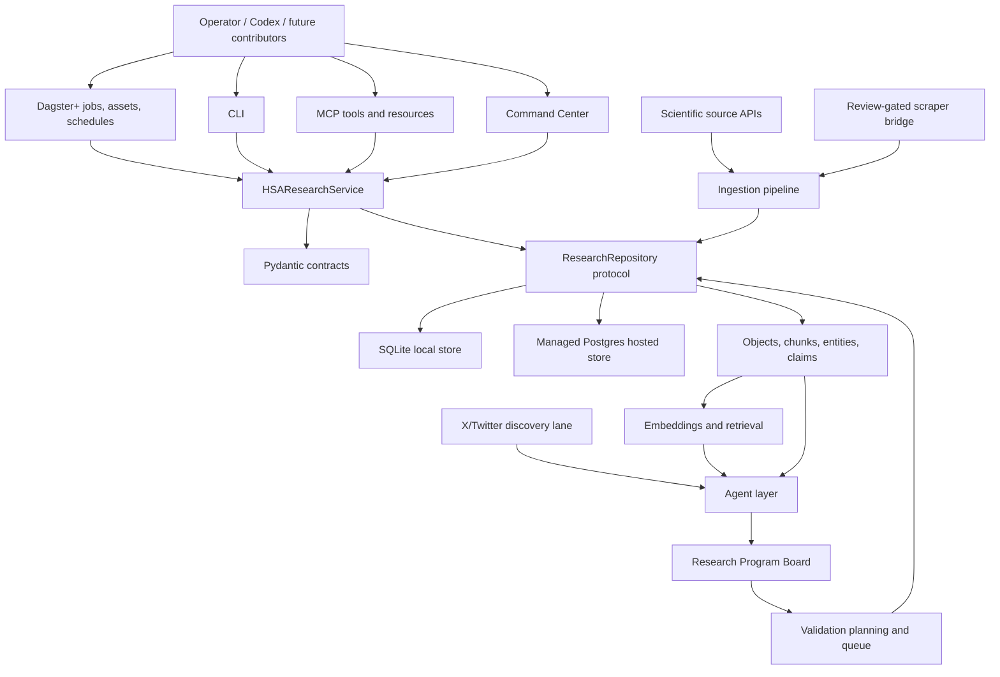
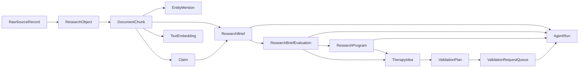
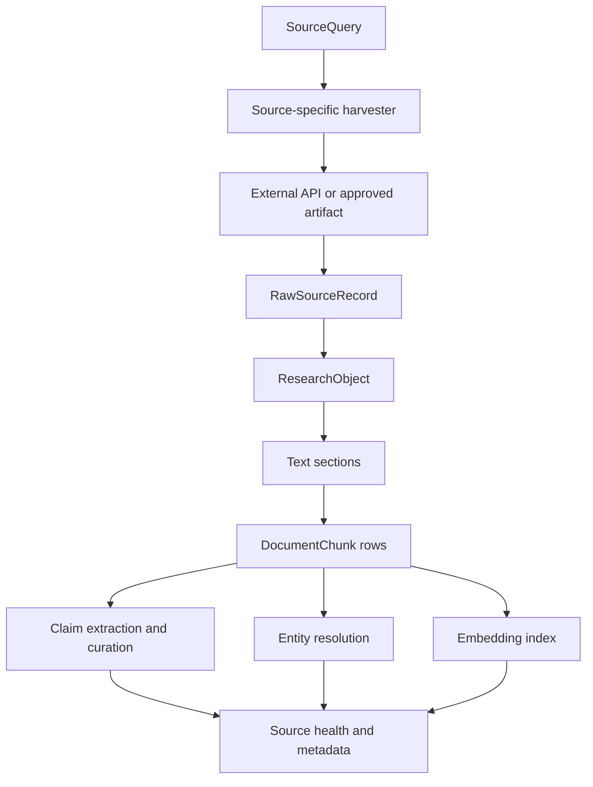
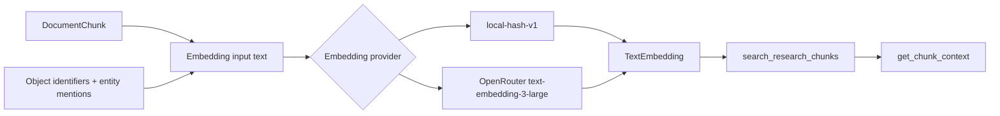
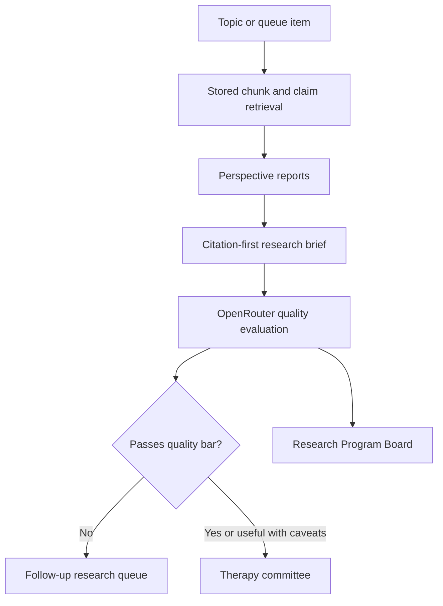
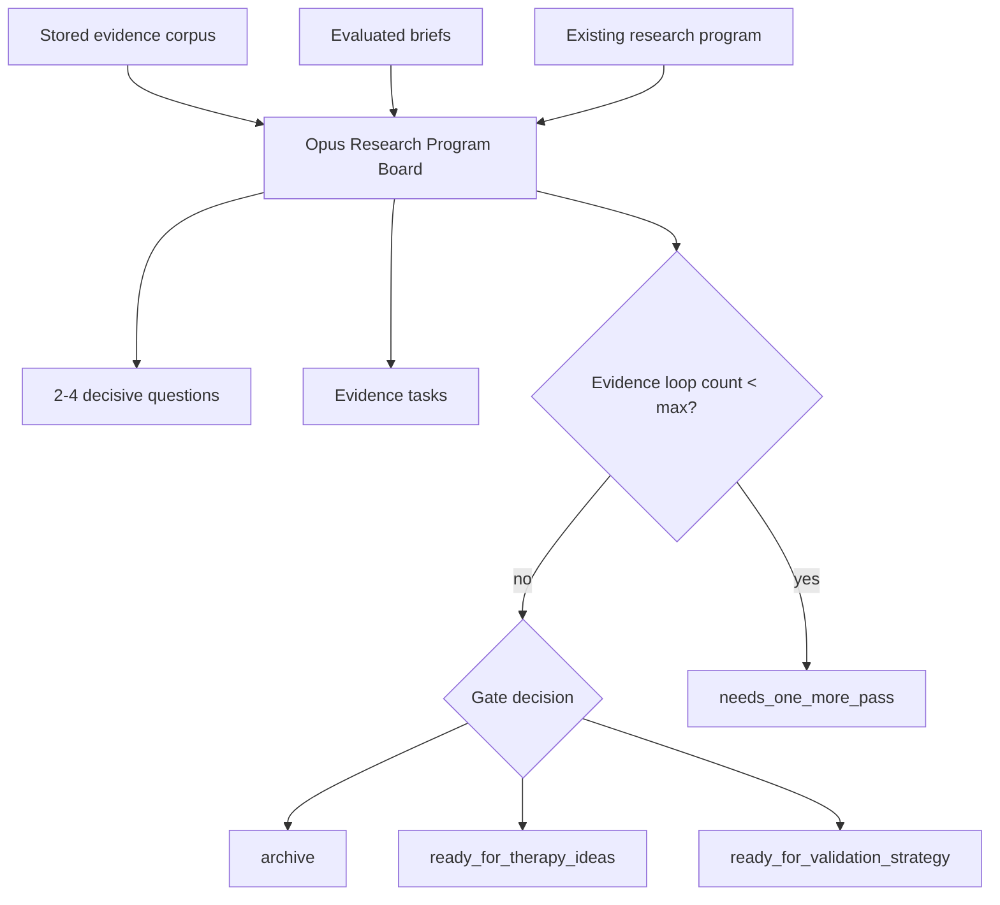
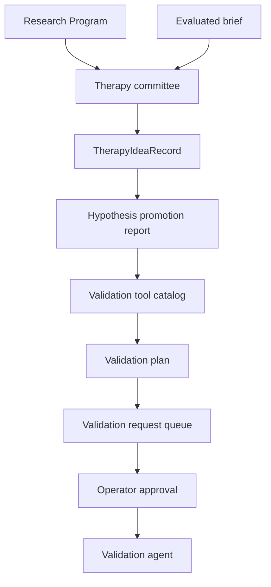
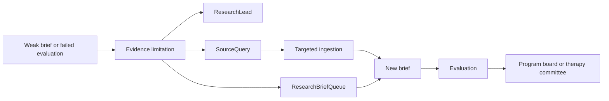

# TWOG v2 System Architecture Snapshot

Status: current architecture snapshot
Repo: `chasepenelli/hsa-dagster`
Updated: 2026-05-08

## 1. What This System Is

TWOG v2 is a research operating system for canine hemangiosarcoma and human
angiosarcoma comparative oncology. It is designed to collect evidence from many
scientific sources, preserve provenance, make that evidence retrievable, run
bounded agents over the evidence, and move only strong ideas toward validation
planning.

The system is intentionally not a single chatbot and not a scraper. It is a
durable research infrastructure layer:

```text
sources -> raw records -> research objects -> chunks -> entities -> claims
  -> embeddings/retrieval -> briefs -> evaluations -> program board
  -> therapy ideas -> validation plans -> approval queue -> validation agents
```

The main operating principle is that agents can recommend, synthesize, critique,
and route work, but durable scientific state must be stored as typed records
with citations, source identifiers, run ledgers, and approval metadata.

## 2. Current Top-Level Architecture



## 3. Why The System Is Built This Way

The v1 system proved that broad ingestion could find useful scientific signal,
but it was difficult to inspect, rerun, and trust. v2 fixes that by separating
responsibilities:

- Harvesters collect source records but do not reason.
- Storage adapters persist typed records and provenance.
- Entity resolution and claim extraction produce deterministic, auditable
  structure over chunks.
- Embeddings make stored chunks retrievable for RAG-style workflows.
- Agents synthesize and review, but every run is recorded in `agent_runs`.
- Dagster orchestrates work and gives hosted visibility.
- MCP, CLI, and the command center all call the same service layer.
- The research program board prevents endless evidence loops by forcing bounded
  gate decisions.

This gives the project a controlled path from messy evidence to useful
scientific hypotheses without letting model output become unreviewed truth.

## 4. Core Code Modules

| Area | Primary files | Purpose |
| --- | --- | --- |
| Contracts | `contracts.py` | Shared typed records, requests, results, queue items, agent payloads, validation objects, and reports. |
| Service boundary | `service.py` | Main application API used by Dagster, CLI, MCP, and the command center. |
| Storage protocol | `repository.py` | Repository interface plus in-memory implementation for tests. |
| Local store | `local_store.py` | SQLite implementation for local development and tests. |
| Hosted store | `postgres_store.py` | Postgres implementation for Dagster+ hosted runs. |
| Repository factory | `storage.py` | Chooses SQLite/Postgres/memory from environment. |
| Dagster resources | `dagster_resources.py` | Injects repository resources into assets. |
| Dagster orchestration | `dagster_assets.py` | Assets, jobs, schedules, asset checks, and hosted reporting. |
| Source registry | `source_registry.py` | Source definitions, capabilities, policies, and source classes. |
| Query policy | `query_policy.py` | Comparative oncology query expansion and starter source queries. |
| Harvesters | `harvesters_v2.py` | API clients and normalizers for literature, full text, chemistry, targets, trials, omics, and safety. |
| Ingestion | `local_ingest.py`, `structured_orchestration.py` | Runs source queries, persists raw/object rows, chunks text, resolves entities, extracts claims, and produces QA reports. |
| Full text | `full_text_triage.py`, `full_text_ops.py` | QA, triage, and recommend-only full-text operations. |
| Scraper bridge | `scraper_bridge.py`, `scrape_parsers.py` | Controlled review-gated scraping for non-API sources and linked articles. |
| Entity resolution | `entity_resolution.py` | Deterministic entities, aliases, and mentions, with optional external vocabulary support. |
| Claims | `claim_extractor.py`, `claim_curator.py` | Conservative extraction and curation of evidence-bearing statements. |
| Embeddings | `embeddings.py` | Local hash and OpenRouter embedding providers, indexer, coverage checks, and retrieval support. |
| Research briefs | `research_brief_agent.py`, `research_brief_evaluation.py` | Multi-perspective synthesis and quality evaluation. |
| Research programs | `research_program_board.py` | Opus-backed big-bet program review, decisive questions, bounded evidence loops, and gate decisions. |
| Therapy ideas | `therapy_committee.py` and service persistence methods | Committee-style idea generation and durable therapy idea records. |
| Validation tools | validation catalog contracts and service methods | Recommend-only catalog of expert review, assay review, omics review, mutation-function review, safety review, and related tools. |
| Validation bridge | `validation_planning.py`, `validation_agents.py` | Converts strong synthesis into validation plans and approval-gated validation queue work. |
| Follow-up loops | `research_leads.py`, `evidence_gap_resolver.py`, `validation_gap_source_pack.py`, `validation_gap_ingest.py`, `source_followup.py` | Converts weak evidence or missing citations into focused follow-up work. |
| X/Twitter lane | `x_topic_monitor.py`, `x_topic_review.py`, `x_linked_article_review.py`, `x_linked_article_followup.py` | Social discovery, linked article review, and durable-source follow-up extraction. |
| Interfaces | `mcp_server.py`, `cli.py`, `command_center_web.py`, `command_center_static/*` | Tool, command, and web access to the same service capabilities. |

## 5. Storage And Provenance

The repository protocol is the system's stability layer. The same service
methods work against SQLite locally and Postgres in Dagster+.

Important durable records include:

- `raw_source_records`: original API or scrape payloads.
- `research_objects`: canonical publications, trials, compounds, proteins,
  structures, safety reports, datasets, and validation outputs.
- `document_chunks`: sectioned text tied to research objects.
- `entity_mentions`: resolved entities attached to chunks.
- `claims`: extracted statements with source provenance.
- `text_embeddings`: embedding records for retrievable chunks.
- `agent_runs`: durable ledger of every agent invocation.
- `agent_run_reviews`: operator and evaluator reviews of agent output.
- `research_leads`: useful signals that are not yet durable evidence.
- `research_brief_queue`: queued synthesis requests.
- `research_briefs`: persisted synthesis outputs.
- `research_brief_evaluations`: quality reviews for briefs.
- `therapy_ideas`: durable therapy idea records and committee provenance.
- `research_programs`: big-bet program records with decisive questions and
  evidence loop counters.
- `validation_plans`: recommended validation strategies.
- `validation_request_queue`: approval-gated validation work items.
- `source_followups`: DOI, PMID, PMCID, NCT, accession, and linked-source
  follow-up tasks.



## 6. Source Ingestion Lanes

The system uses separate lanes because each source type proves a different kind
of fact.

| Lane | Sources | What it can support | What it cannot support alone |
| --- | --- | --- | --- |
| Scholarly metadata | PubMed, Europe PMC, OpenAlex, Crossref, Unpaywall | Publication discovery, abstracts, identifiers, citation context | Full body-text claims unless full text is retrieved |
| Open-access full text | Europe PMC, PMC OA | Body-text evidence, methods, tables, detailed claims | Closed-access papers or unsupported licenses |
| Clinical and veterinary trials | ClinicalTrials.gov, AVMA VCTR where available | Trial design, conditions, arms, registry status | Peer-reviewed efficacy unless linked publications exist |
| Chemistry | PubChem, ChEMBL | Compound identity, assay records, target interaction context | Clinical response in HSA |
| Targets and structures | UniProt, RCSB PDB | Protein identity, target metadata, structural context | Disease response alone |
| Omics/data | GEO, SRA, ICDC | Expression, mutation, datasets, cohorts | Clinical interpretation without review |
| Safety | openFDA animal events | Safety signals and adverse-event context | Incidence or causality alone |
| Social discovery | X/Twitter and linked articles | Leads, new links, people, discussion signals | Durable scientific evidence |
| Scraper bridge | Approved source profiles | Controlled snapshots and parser-reviewed records | General web crawling |
| Validation gaps | Generated source queries | Focused retrieval for missing evidence | Automatic validation or treatment decisions |

## 7. Ingestion Flow



The key design choice is that ingestion is deterministic and provenance-first.
Agents do not decide what the source said during ingestion. They operate after
the source has been normalized and stored.

## 8. Embeddings And RAG Readiness

The embedding layer is the RAG foundation. It indexes stored chunks, not hidden
chat memory.

Current behavior:

- Local deterministic fallback: `local-hash-v1`.
- Hosted preferred embedding: `openrouter:openai/text-embedding-3-large`.
- Embedding text includes chunk text plus research object context and entity
  mentions.
- Reindexing is idempotent by input hash.
- Maintenance checks active-model coverage and orphaned embeddings.
- MCP and service retrieval expose chunks and object context, not raw vectors.



## 9. Agent Layer

Every meaningful agent run is wrapped through `AgentRunner` and persisted in
`agent_runs`.

The ledger records:

- agent name and version,
- model profile,
- status,
- started/completed timestamps,
- source key and partition date when relevant,
- Dagster run ID,
- typed input payload,
- typed output payload,
- summary,
- errors,
- metadata.

Current major agent lanes:

- Research brief agents synthesize stored evidence from multiple perspectives.
- Research brief evaluators judge citation coverage, balance, contradiction
  handling, novelty, actionability, and weakness transparency.
- Therapy committee agents produce therapy ideas and downstream experiments.
- Full-text ops agents review source health and recommend operational actions.
- X/Twitter review agents decide whether social signals should become leads or
  source follow-ups.
- Evidence gap and follow-up agents turn weak outputs into targeted retrieval
  work.
- Validation agents review approved queue items.
- Agent performance evaluator agents review which agents, prompts, and models
  produce useful work.
- Research Program Board agents use Opus for big scientific thesis review.

## 10. Model Policy

The model policy separates routine synthesis from big-bet program reasoning.

| Work type | Default model policy |
| --- | --- |
| Research briefs | Sonnet latest, currently run as `anthropic/claude-sonnet-4.6` in hosted jobs |
| Brief evaluations | Sonnet latest |
| Therapy committee | Sonnet latest |
| Expert/safety style review agents | Sonnet latest unless explicitly promoted |
| Follow-up refinement | Sonnet or deterministic guardrails depending on lane |
| Agent performance evaluator | Sonnet latest |
| Research Program Board | Opus latest / explicit Opus run, currently tested with `anthropic/claude-opus-4.7` |

The reason is cost and role separation. Sonnet is strong enough for routine
briefing, critique, and queue work. Opus is reserved for high-level scientific
program judgment where the system is deciding whether a whole research program
should be promoted, narrowed, or archived.

## 11. Research Brief Flow



Briefs are expected to be citation-first and explicit about weaknesses. The
quality evaluator does not need every useful brief to pass. A failed but
specific evaluation can still be useful because it tells the system exactly
which evidence is missing.

## 12. Research Program Board

The Research Program Board is the big-idea layer. It is not the same as a
therapy idea.

- A research program is a broad scientific bet with a thesis, disease model,
  decisive questions, evidence tasks, metrics, pass/fail values, stop criteria,
  and downstream therapy families.
- A therapy idea is a narrower candidate intervention or combination that can
  be planned, reviewed, and validated downstream.

Canonical program flow:

```text
evidence corpus -> Research Program Board -> decisive questions
  -> capped evidence tasks -> program review -> gate decision
  -> therapy ideas -> validation packets
```



Gate decisions are limited to:

- `archive`
- `needs_one_more_pass`
- `ready_for_therapy_ideas`
- `ready_for_validation_strategy`

As of this snapshot, the board has explicit loop-cap enforcement. If a model
asks for `needs_one_more_pass` after the max evidence loop count has been
reached, the parser forces a terminal/promotional gate based on scores and
available downstream opportunities. This prevents the system from looping
forever.

## 13. Current Active Program Example

The active big-bet program is:

```text
vascular injury / coagulation / angiogenesis ecology in canine HSA and human angiosarcoma
```

The program asks whether canine splenic HSA and human angiosarcoma behave as a
coupled vascular ecosystem disease involving endothelial driver mutations, ECM
remodeling, coagulation activation, angiogenesis, and alternative
vascularization modes.

Current decisive questions include:

- Whether PIK3CA / TP53 / PTEN / NRAS mutation status predicts improved OS/PFS
  under biomarker-stratified mTOR or HDAC inhibitor arms.
- Whether endothelial-targeted immunomodulatory modalities produce a 1-year OS
  signal above the historical benchmark with immune or vascular biomarkers.
- Whether anti-angiogenic or multi-RTK therapy can be made safe enough in
  canine HSA using viscoelastic monitoring and drug-hold rules.
- Whether vascular co-option is a material metastatic mechanism explaining the
  ceiling of pure anti-angiogenic monotherapy.

Current downstream therapy opportunity families include:

- biomarker-stratified mTOR or HDAC inhibition,
- anti-extracellular vimentin vaccine plus doxorubicin replication,
- VCM-gated pazopanib or sorafenib combinations restricted to enriched
  subgroups,
- ECM/co-option-directed combinations only if the mechanism is confirmed.

## 14. Therapy Idea And Validation Bridge

Therapy ideas are downstream children of programs and evaluated briefs. They
should not be created endlessly. They should be created when a program is ready
to narrow into testable intervention families.



The validation tool catalog is recommend-only in this phase. It helps agents
choose review and planning capabilities such as:

- expert review,
- assay design/review,
- target expression review,
- biomarker-response assay design,
- omics expression review,
- mutation-function review,
- safety/translational risk review.

No live wet lab, RunPod, docking, Boltz, MD, or paid external compute dispatch
is enabled by default in this architecture snapshot.

## 15. Validation Queue And Autopilot

Validation is queue-first and approval-first.

Key rules:

- A brief or therapy idea can produce a validation plan.
- A plan can produce queue items only when it has enough context.
- Approval is separate from dispatch.
- Dispatch checks blockers and records all outputs.
- Autopilot is conservative, budgeted, and limited to low-risk review-style
  tasks unless explicitly expanded.

This design prevents high-cost or high-risk validation actions from happening
just because an agent produced a plausible idea.

## 16. Follow-Up And Evidence Gap Loop

When an evaluator or validation agent finds weak evidence, the system should not
loop blindly. It routes the weakness into focused follow-up work:



The important constraint is that evidence loops are bounded at the program
level. A research program has a max evidence loop count, default `2`. After
that, it must be promoted, narrowed, or archived.

## 17. Dagster Role

Dagster is the operational control plane for hosted execution.

Main job classes:

- ingestion and smoke jobs,
- full-text refresh and source/date jobs,
- source health jobs,
- embedding index and maintenance jobs,
- research brief queue and evaluation jobs,
- research program board and evidence-loop jobs,
- therapy committee jobs,
- validation plan and validation queue jobs,
- evidence gap and source follow-up jobs,
- X/Twitter and linked-article review jobs,
- command center job.

Dagster does not own the business logic. Dagster assets call service methods
through the injected repository resource. This keeps CLI, MCP, tests, and
hosted orchestration aligned.

## 18. MCP And CLI Role

MCP and CLI expose the same capabilities through typed contracts.

Important MCP/CLI categories:

- retrieval: search chunks, get chunk context, get research objects,
- claims and candidates: search claims, get candidates,
- briefs: run briefs, list briefs, evaluate briefs, manage queues,
- programs: run board, list programs, launch evidence loops,
- therapy ideas: list/get/report persisted ideas,
- validation: plan, queue, approve, dispatch, report,
- source follow-up: queue identifiers and ingest follow-up records,
- agent ledger: get/list agent runs and performance reports.

The reason to keep these surfaces is that humans, LLMs, and future contributors
should all use the same contracts rather than bypassing storage.

## 19. Command Center Direction

The command center is the operator layer. It should show:

- source health,
- ingestion status,
- agent runs,
- action items,
- research leads,
- research brief queue,
- evaluated briefs,
- therapy ideas,
- research programs,
- validation plans,
- validation queue items,
- dispatch status,
- model and agent performance.

Near-term command-center priority is not a large dashboard for its own sake. It
should show the work items that need decisions: promote, demote, dispatch,
archive, rerun, or follow up.

## 20. Current Architectural Risks

| Risk | Current mitigation |
| --- | --- |
| Citation duplication inflates evidence breadth | Citation dedupe/provenance hardening and evaluator warnings. |
| Model asks for endless evidence loops | Research Program Board max loop count plus parser-level gate enforcement. |
| Social posts become evidence | Social lane routes to leads and source follow-ups, not durable claims. |
| Full text is slow or parser-fragile | Source/date jobs, full-text QA, triage, ops agent, conservative schedules. |
| Weak briefs move downstream | OpenRouter quality evaluation and follow-up queues. |
| Hosted worker state disappears | Managed Postgres repository backend. |
| Expensive validation runs fire too early | Approval-first validation queue and recommend-only validation tools. |
| Model selection drifts silently | Model policy stored in payloads and agent run metadata. |

## 21. Near-Term Build Priorities

1. Finish enforcing finite Research Program Board gates in hosted runs.
2. Convert `ready_for_therapy_ideas` programs into a small number of durable,
   high-level therapy ideas.
3. Generate validation packets only for narrowed ideas with explicit metrics,
   tools, and pass/fail values.
4. Improve citation dedupe and provenance displays so the board sees unique
   evidence instead of repeated chunks from the same review.
5. Add command-center panels for research programs, therapy ideas, and briefs.
6. Keep using Dagster for proof runs so each major lane is observable.

## 22. Summary

TWOG v2 is now best understood as native AI research infrastructure:

- durable evidence ingestion,
- typed storage,
- retrieval over stored chunks,
- auditable agent ledgers,
- quality evaluation,
- finite research programs,
- therapy idea persistence,
- approval-gated validation planning,
- operator control through Dagster, MCP, CLI, and the command center.

The system is built to keep moving from broad evidence to specific scientific
programs, then from programs to therapy ideas, and from therapy ideas to
validation plans without allowing unbounded loops or unreviewed model output.
