# TWOG v2 System Guide

Status: active architecture guide
Repo: `chasepenelli/hsa-dagster`
Updated: 2026-05-04

## 1. Purpose

TWOG v2 is a research operating system for canine hemangiosarcoma and human
angiosarcoma comparative oncology. It is designed to collect scientific
evidence, preserve provenance, retrieve relevant context, synthesize research
briefs, generate validation plans, and let operators manage the work through
Dagster, MCP tools, CLI commands, and a local command center.

The project is not only an ingestion script. The core idea is a durable research
engine:

1. Sources continuously produce raw records.
2. Raw records become canonical research objects.
3. Research objects produce chunks, entities, claims, embeddings, leads, briefs,
   validation plans, and validation queue items.
4. Agents use the stored evidence to recommend and synthesize.
5. Humans keep control over promotion, dispatch, and interpretation.

The design choice that drives nearly every module is separation of concerns:
harvesters collect, resolvers normalize, stores persist, agents review, Dagster
orchestrates, MCP exposes typed tools, and the command center gives the operator
visibility.

## 2. Why This System Exists

The first version proved that useful research could be collected, but it was
hard to inspect, rerun, trust, and extend. TWOG v2 fixes that by making each
capability durable and typed.

The system has to support several working realities:

- Canine HSA and human angiosarcoma evidence must be reviewed together.
- Useful signals can come from PubMed, Europe PMC, PMC OA, Crossref, OpenAlex,
  ClinicalTrials.gov, ChEMBL, PubChem, UniProt, RCSB PDB, openFDA, X/Twitter,
  linked articles, and future omics/GPU lanes.
- Some sources are clean APIs. Some require scraper profiles. Some are only
  watchlist leads until a DOI, PMID, PMCID, NCT, accession, or other durable
  identifier is found.
- LLMs are useful for synthesis and review, but durable evidence must still
  come from stored citations, chunks, claims, and source records.
- Hosted Dagster runs need the same service contracts as local development.

The result is a system that can grow source by source and agent by agent without
becoming a black box.

## 3. Top-Level Architecture

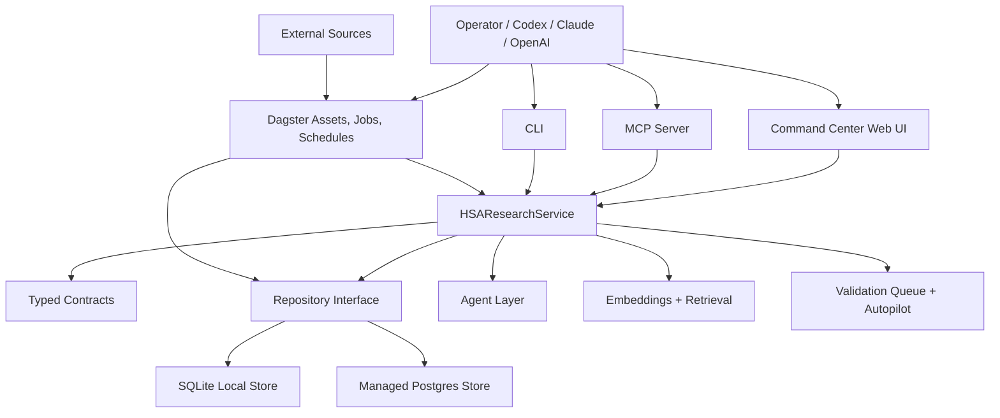

### Why this shape

- Dagster gives visibility, schedules, retries, checks, and hosted execution.
- The service layer keeps business logic out of web handlers, MCP tools, CLI
  commands, and Dagster assets.
- Typed contracts keep agent inputs and outputs inspectable.
- The repository interface lets local SQLite and hosted Postgres behave the
  same way.
- MCP tools make the system usable by humans and LLMs through the same typed
  operations.
- The command center gives a lightweight operator layer before committing to a
  heavier frontend stack.

## 4. Core Module Map

| Module | Role | Why It Exists |
| --- | --- | --- |
| `contracts.py` | Pydantic contracts for records, requests, results, queues, agents, validation, embeddings, and command center payloads. | Prevents untyped agent blobs from becoming the system boundary. |
| `service.py` | Main application boundary. Coordinates repository reads/writes, agents, queues, validation, command center reports, and retrieval tools. | Keeps orchestration surfaces thin and consistent. |
| `repository.py` | Abstract repository contract plus in-memory implementation. | Lets tests and local tools run without Postgres while preserving the same methods. |
| `local_store.py` | SQLite repository adapter. | Local-first development, deterministic tests, easy inspection. |
| `postgres_store.py` | Postgres repository adapter. | Hosted Dagster persistence and shared production state. |
| `storage.py` | Repository factory selected by environment. | Lets the same service run locally or in hosted Dagster. |
| `dagster_assets.py` | Dagster assets, asset checks, jobs, and schedules. | Makes ingestion, embeddings, agents, quality reports, and queues observable and runnable. |
| `dagster_resources.py` | Dagster resources for repository construction. | Avoids rebuilding storage logic inside every asset. |
| `harvesters_v2.py` | Structured source harvesters. | Pulls from API sources without reasoning or mutation beyond normalized raw data. |
| `structured_orchestration.py` | Structured ingestion pipeline. | Converts source records into durable objects, chunks, entities, claims, and curation reports. |
| `scraper_bridge.py` and `scrape_parsers.py` | Scraper profiles and parser lane. | Handles sources that lack clean APIs while keeping scraping explicit and reviewable. |
| `full_text_triage.py` and `full_text_ops.py` | Full-text health and ops recommendations. | Makes unstable full-text lanes inspectable before scheduling them aggressively. |
| `entity_resolution.py` | Deterministic entity resolution. | Widens tagging beyond fixed dictionaries while staying reproducible. |
| `claim_extractor.py` and `claim_curator.py` | Claim extraction and curation. | Converts chunks into evidence-bearing statements with provenance. |
| `embeddings.py` | Embedding index and retrieval helpers. | Builds the RAG foundation over stored chunks without exposing raw vectors. |
| `research_brief_agent.py` | Multi-perspective research brief synthesis. | Lets different agent perspectives search, cite, and synthesize from stored evidence. |
| `research_brief_evaluation.py` | Quality evaluator for persisted briefs. | Prevents weak or uncited briefs from moving downstream. |
| `validation_planning.py` | Converts high-quality briefs into validation plans. | Bridges synthesis into concrete next experiments and review tasks. |
| `validation_agents.py` | Validation agent execution and dispatch outputs. | Lets approved validation tasks get reviewed by real agents. |
| `therapy_committee.py` | Committee-style therapy idea generation. | Produces ranked therapy ideas with explicit evidence, risks, and next experiments. |
| `research_leads.py` | Lead storage and lifecycle. | Keeps low-evidence but interesting signals organized without treating them as citations. |
| `x_topic_monitor.py`, `x_topic_review.py`, `x_linked_article_review.py`, `x_linked_article_followup.py` | X/Twitter and linked-article monitoring. | Captures timely social signals, then separates watchlist context from durable evidence. |
| `source_health.py` and `source_followup.py` | Source health and follow-up queues. | Turns ingestion gaps into actionable queues instead of silent misses. |
| `evidence_gap_resolver.py`, `validation_gap_source_pack.py`, `validation_gap_ingest.py` | Evidence gap execution path. | Lets weak validation outputs produce focused follow-up research work. |
| `mcp_server.py` | MCP tool/resource exposure. | Gives LLMs and humans clean tool contracts for the system. |
| `cli.py` | CLI access to service methods. | Fast local testing, smoke runs, and operator actions. |
| `command_center_web.py` and `command_center_static/*` | Local web command center. | Lightweight control surface for queues, briefs, ideas, leads, and validation actions. |

## 5. Storage And Provenance

The storage model is payload-oriented but typed at the service boundary. Both
SQLite and Postgres persist full JSON payloads while also indexing common query
columns such as status, source, created time, IDs, readiness, and quality flags.

Important durable concepts:

- `raw_source_records`: original source payloads.
- `research_objects`: canonical publications, trials, datasets, compounds,
  structures, safety reports, and validation outputs.
- `document_chunks`: chunked text sections attached to research objects.
- `entity_mentions`: resolved targets, diseases, compounds, proteins, and other
  entities.
- `claims`: provenance-backed statements extracted from chunks.
- `text_embeddings`: vectors for chunk retrieval.
- `agent_runs`: durable ledger of every agent invocation.
- `research_leads`: interesting signals that may need follow-up.
- `research_briefs`: persisted synthesis outputs.
- `research_brief_evaluations`: quality reviews for briefs.
- `validation_plans`: generated validation plans.
- `validation_request_queue`: dispatchable validation tasks.

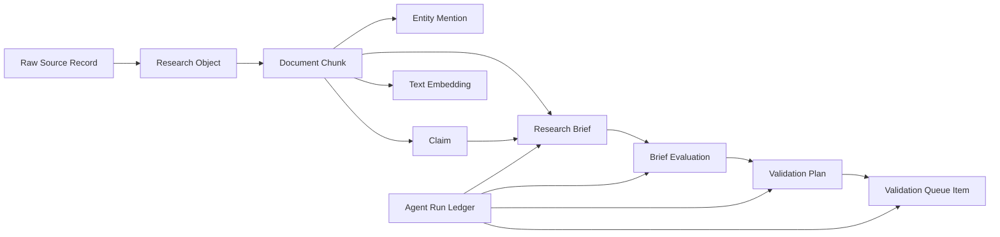

### Why payload plus indexes

During active system design, contracts evolve quickly. Storing full typed
payloads avoids destructive migrations for every contract change, while indexed
columns keep operational queries fast enough for Dagster jobs, CLI commands,
and the command center. This keeps the build flexible without giving up durable
history.

## 6. Ingestion Lane

The ingestion lane pulls source data, normalizes it, stores it, chunks it, and
prepares it for entity resolution, claims, and retrieval.

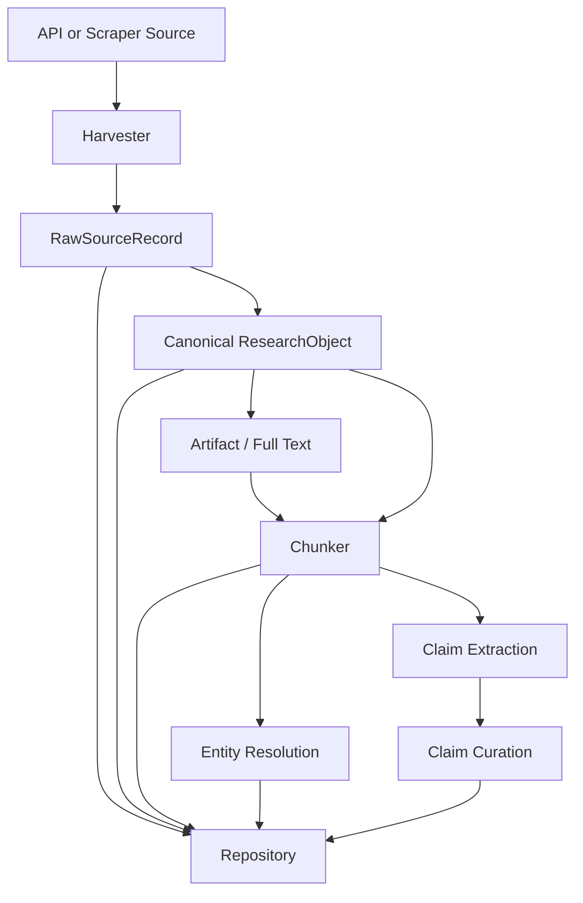

### Why harvesters do not reason

Harvesters are intentionally narrow. Their job is to fetch and map source
records. Reasoning is handled later by deterministic resolvers, extraction
logic, and agents. This makes source behavior testable and prevents an LLM from
silently changing the meaning of source data at ingestion time.

### Source categories already represented

- Literature and metadata: PubMed, Europe PMC, PMC OA, OpenAlex, Crossref.
- Structured biomedical APIs: PubChem, ChEMBL, UniProt, RCSB PDB, openFDA
  animal events.
- Clinical and follow-up sources: ClinicalTrials.gov, Unpaywall follow-up,
  source-specific follow-up lanes.
- Social/current awareness: X/Twitter topic monitoring and linked articles.

## 7. Full-Text Lane

Full text is handled separately because it is slower, less predictable, and
more legally and technically variable than metadata.

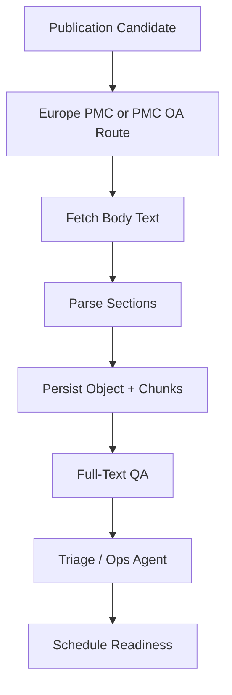

### Why this lane is conservative

Metadata APIs can usually be pulled on a schedule. Full text can fail because
of licenses, source outages, parser edge cases, XML variation, missing body
sections, or slow response times. TWOG v2 isolates full-text jobs by source and
by source/date partition so a PMC OA issue does not block Europe PMC, PubMed,
or structured source refreshes.

The `FullTextOpsAgent` is recommend-only. It does not flip schedules or launch
jobs. It reviews health and triage outputs, then recommends actions such as
`run_full_text_smoke`, `inspect_parser`, `inspect_license`,
`reduce_batch_size`, or `ready_to_enable_schedule`.

## 8. Entity, Claim, And Embedding Layer

After chunks exist, the system prepares them for retrieval and evidence
reasoning.

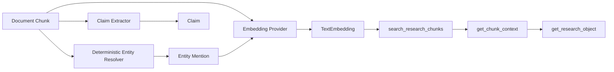

### Why deterministic entity resolution still matters

Deterministic does not mean weak keyword dictionaries. It means reproducible
resolution through stable vocabularies and APIs where possible. That gives the
system a wide, repeatable floor before agents reason over the evidence. For a
novel target or protein discovery project, this is important because the entity
surface cannot be limited to what was manually written in a Python dictionary.

### Why `text-embedding-3-large` became the active model

The embedding lane supports local hash embeddings for tests and OpenRouter
embeddings for real retrieval. The production path uses
`openrouter:openai/text-embedding-3-large` because bakeoff testing favored it
for retrieval quality. The local hash model remains useful for offline tests
and deterministic smoke runs, but it is not the intended long-term RAG model.

## 9. Research Lead Lane

Research leads represent signals that may matter but are not yet durable
evidence.

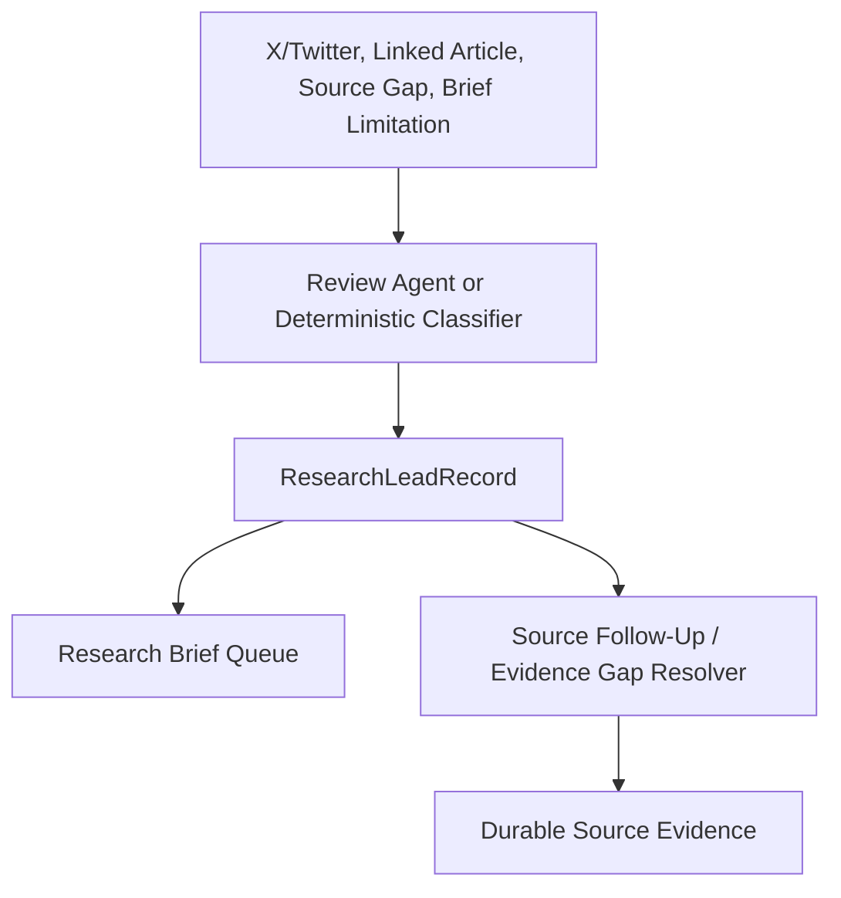

### Why leads are separate from evidence

This prevents a tweet, marketing page, press release, or conference abstract
from being treated as a citation. Leads can drive follow-up, but research
briefs and validation work need durable citations wherever possible.

## 10. Research Brief Lane

The research brief lane is now durable. It creates citation-first synthesis
from stored chunks and claims, then persists the result for review and
downstream validation.

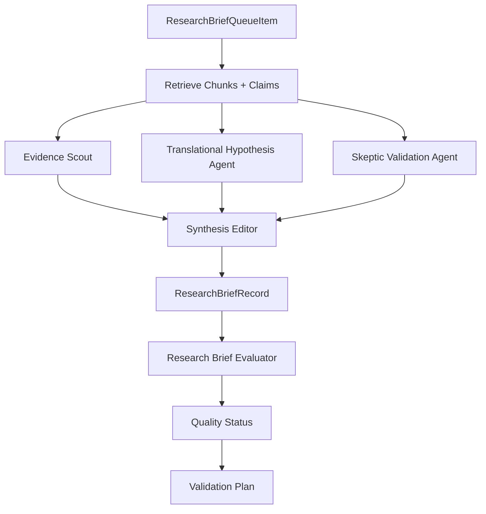

### Why multiple perspectives

The brief system is designed to avoid one-note synthesis. Different agents
look for different kinds of evidence:

- evidence scouting and citation grounding;
- translational opportunity across canine and human disease;
- skepticism, limitations, and failure modes;
- final synthesis into an operator-readable brief.

The result is a brief that carries citations, findings, ranked hypotheses,
open questions, evidence limitations, and hard errors.

### Why brief evaluation exists

Synthesis alone is not enough. A separate evaluator checks whether the brief is
ready for hypothesis review or validation planning. The evaluator can run with
OpenRouter, and a deterministic floor remains available for tests. The quality
gate prevents contradictory outputs from passing. In particular, a model cannot
return `passes_quality_bar=true` unless readiness and score also satisfy the
promotion rules.

## 11. Validation Planning And Queue

High-quality briefs can become validation plans. Plans become queue items that
operators can approve and dispatch.

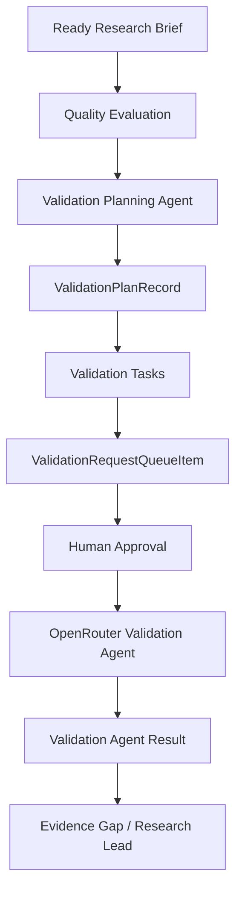

### Why approval exists

The system is moving toward automated throughput, but scientific validation
work should remain controlled. Approval and dispatch are separate states so an
operator can inspect the plan, approve it, and either dispatch manually or let
autopilot handle safe low-risk items later.

### Why autopilot exists

The validation queue can grow faster than a human reviews it. Autopilot is a
conservative policy layer. It can approve and dispatch a small number of
eligible items after a manual grace period, with max-per-run and budget caps.
This keeps the system moving without turning the whole queue into uncontrolled
automation.

## 12. Therapy Committee Lane

The therapy committee layer creates higher-level ideas from evidence and
validation context.

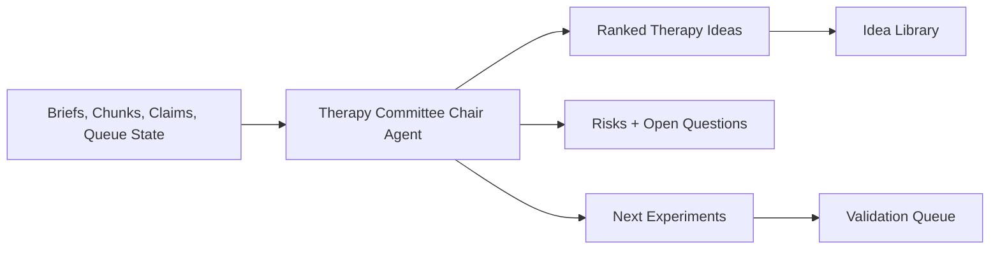

### Why this layer comes after evidence plumbing

The goal is not simply to collect papers. The goal is to produce candidate
therapies, mechanisms, assays, and next experiments. The committee layer is
where the research memory becomes an idea generator, but it only works if the
underlying library is organized and retrievable.

## 13. Dagster Orchestration

Dagster is the operating graph. It gives each lane a visible asset, job, check,
and schedule.

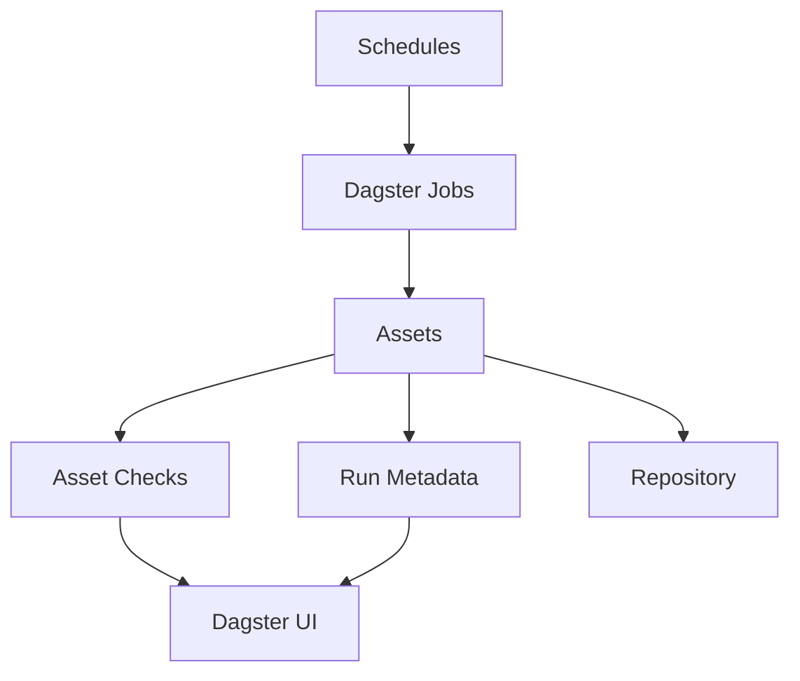

### Important job groups

- Source ingestion: `literature_corpus_harvest_job`,
  `structured_source_pipeline_job`, source follow-up ingest jobs.
- Full text: `literature_full_text_*`, `europe_pmc_full_text_*`,
  `pmc_oa_full_text_*`, source/date partition job.
- Retrieval: `embedding_index_job`, `embedding_maintenance_job`.
- Health and operations: `source_health_report_job`,
  `full_text_ops_agent_job`, `command_center_job`.
- Research briefs: `research_brief_queue_*`, `research_brief_agent_job`,
  `research_brief_library_job`, `research_brief_evaluation_job`,
  `research_brief_quality_job`, `research_brief_followup_queue_job`.
- Validation: `validation_plan_job`, `validation_request_queue_job`,
  `validation_autopilot_job`.
- Social/current awareness: `x_topic_monitor_review_job`,
  `x_linked_article_review_job`, `x_linked_article_followup_job`.

### Why staggered schedules

The system currently uses simple staggered schedules instead of sensors or a
single chained graph. This is intentional. Staggered schedules are easier to
debug while the data and agent lanes are still being hardened. Once source/date
partitions and failure patterns are stable, sensors can be introduced where
they provide real leverage.

## 14. MCP, CLI, And Command Center

The same service methods are exposed through several operator surfaces.

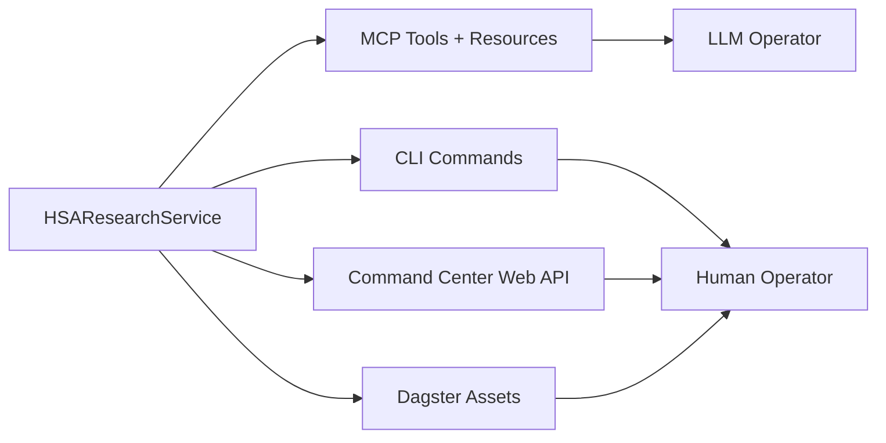

### Why expose MCP tools

MCP forces every capability to have a typed contract. That makes the system
usable from conversational agents while keeping the same functions available to
humans and scripts. Tools such as `search_research_chunks`,
`get_chunk_context`, `get_research_object`, `run_research_brief`,
`list_research_briefs`, `evaluate_research_brief`, validation planning, queue
management, source follow-up, and command center reporting all become explicit
capabilities instead of hidden internal calls.

### Command center pages

The command center currently exposes:

- Operations: action items, validation autopilot, validation queue, research
  leads, recommendations, recent agent runs, and research brief queue.
- Briefs: persisted research briefs with quality status, full brief text,
  citation preview, hypothesis preview, evidence limitations, and filters.
- Ideas: therapy ideas and validation hypotheses derived from committee and
  validation-planning outputs.

The command center is deliberately lightweight. It uses the Python stdlib HTTP
server and static assets so it can evolve quickly while the backend system is
still changing.

## 15. OpenRouter And Deterministic Floors

The system now supports real OpenRouter-backed agents for synthesis,
evaluation, and validation. Deterministic paths remain for tests, local smoke
runs, and offline safety.

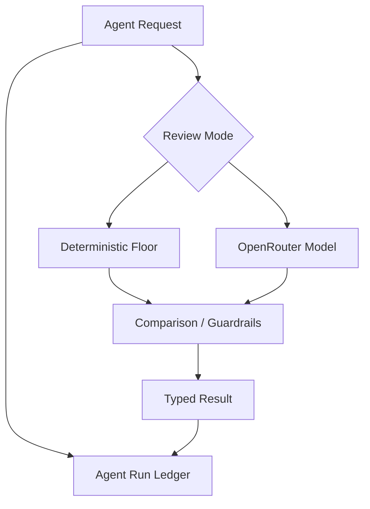

### Why keep deterministic paths

Tests need to run without spending money or requiring network access. Operators
also need a fallback when a model provider is unavailable. Deterministic outputs
are not the intended scientific review path, but they are important for
reproducibility, CI, and safety checks.

## 16. Current Operator Flow

The main research loop currently looks like this:

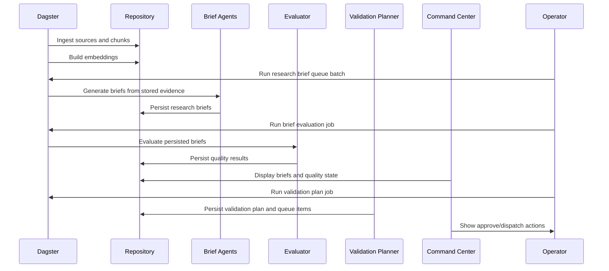

## 17. What Is Built Versus Planned

Built now:

- Local SQLite and hosted Postgres repository adapters.
- Typed contracts for sources, chunks, entities, claims, embeddings, agents,
  briefs, evaluations, validation plans, queue items, and command center
  reports.
- Dagster assets, jobs, checks, and schedules across ingestion, full text,
  embeddings, source health, research briefs, validation, X/Twitter, and
  command center reporting.
- MCP tools and resources for the major service methods.
- CLI access to major service methods.
- Agent run ledger.
- Research brief queue, runner, persisted brief library, evaluator, and quality
  report.
- Validation planning, validation request queue, approval, dispatch, and
  conservative autopilot.
- Command center pages for operations, briefs, and ideas.
- OpenRouter-backed routes for real agent runs, with deterministic floors for
  tests and smoke paths.

Planned or still maturing:

- Deeper omics-specific ingestion and interpretation.
- More source/date partition coverage.
- More full-text parser hardening and source-specific fallbacks.
- GPU validation lanes through RunPod or Docker for structure prediction,
  docking, molecular dynamics, and related tasks.
- A richer hosted command center once backend contracts stabilize.
- More formal cost accounting per model, job, and lane.

## 18. Engineering Rules That Keep The System Useful

1. Source ingestion must remain provenance-first.
2. Watchlist leads must not become evidence until durable identifiers or source
   records are found.
3. Agent outputs must be persisted in the agent ledger.
4. Briefs must be citation-first.
5. Quality evaluation must happen before validation planning.
6. Validation dispatch must remain explicit or controlled by conservative
   autopilot settings.
7. New sources should enter through clear source lanes, not ad hoc scripts.
8. New frontend features should read from service-backed APIs, not directly
   from storage.
9. Expensive compute should stay async and observable through Dagster.
10. The MCP surface should remain typed and stable enough for human and LLM
    operators to share.

## 19. How To Read This Repo

For architecture, start here:

1. `contracts.py` for the system vocabulary.
2. `repository.py`, `local_store.py`, `postgres_store.py`, and `storage.py` for
   persistence.
3. `service.py` for the main use cases.
4. `dagster_assets.py` for operational graph and schedules.
5. `mcp_server.py` and `cli.py` for external access.
6. `command_center_web.py` and `command_center_static/*` for the operator UI.
7. Source-specific modules such as `harvesters_v2.py`, `scraper_bridge.py`,
   `x_topic_review.py`, `research_brief_agent.py`, and
   `validation_planning.py` for lane details.

## 20. Practical Summary

TWOG v2 is being built as a durable, inspectable research engine. The important
choice was to spend complexity on contracts, storage, orchestration, provenance,
and operator control instead of building a one-off agent demo. That makes the
system slower to scaffold but much stronger long term. Each new capability can
now be added as a source lane, an agent lane, a retrieval/read tool, a Dagster
asset, an MCP tool, and a command center view without changing the whole
system.
